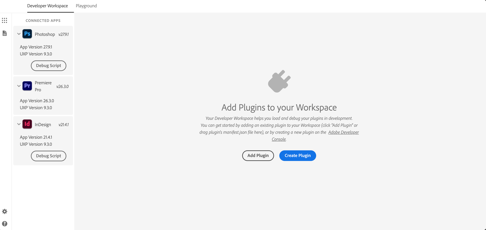

# Understanding UXP APIs

Learn about the two types of APIs available in UXP and when to use each one.

## Overview

Once you've built your first plugin, you're ready to tackle more complex tasks. The key to building useful plugins is understanding which APIs to use and when.

The UXP platform provides two complementary sets of APIs:

1. **UXP Core APIs**: for building user interfaces, file operations, network calls, and general functionality.
2. **Host APIs**: for interacting with and modifying the host application's own data, such as Photoshop's documents and layers or Premiere's projects and sequences.

More often than not, you'll need to use both together to build the functionality you want. Here's how each one works.

## UXP Core APIs

UXP Core APIs provide the fundamental building blocks for your plugin's functionality, and are **shared** across all UXP-enabled Adobe applications. These APIs let you:

- **Create user interfaces** using HTML, CSS, and JavaScript
- **Access the file system** to read and write files
- **Make network requests** to communicate with external services
- **Handle clipboard operations** for copy/paste functionality
- **Work with system utilities** like shell commands and OS information

### Accessing UXP APIs

The way you access UXP APIs depends on the specific API itself.

**Global APIs** are available immediately without any import. For example:

```javascript
// Crypto API is globally available
const hash = crypto.randomUUID();

// Document API is globally available
const button = document.createElement("sp-button");
```

**Module-based APIs** require importing with `require()`. For example:

```javascript
// Parent UXP module
const uxp = require("uxp");

// File system access
const fs = require("fs");

// Operating system utilities
const os = require("os");
```

**Permission-based APIs** also need to be allow-listed in your plugin's `manifest.json`. For example, to use the file system or make network requests, you must declare the appropriate permissions. The [manifest guide](../../concepts/manifest/index.md#requiredpermissions) walks through this in detail.

## Host APIs

Every UXP-enabled application adds its own host API on top of the shared UXP Core APIs, giving you direct access to that application's document model:

- **Photoshop** adds APIs for documents, layers, selections, and actions, retrieved with `require("photoshop")`.
- **InDesign** adds APIs for documents, pages, stories, and frames, retrieved with `require("indesign")`.
- **Premiere** adds APIs for projects, sequences, tracks, clips, and markers, retrieved with `require("premierepro")`.
- **Media Encoder** adds APIs for the encoding queue, jobs, and presets, retrieved with `require("mediaencoder")`.

```javascript
// Example: Premiere's host API entry point
const app = require("premierepro");
```

Check your host's own reference under **Product API Refs** in the top navigation to see the full list of what it exposes.

<InlineAlert variant="warning" slots="heading, text"/>

Don't confuse the two DOMs

A host's application DOM (for example, Photoshop's documents and layers) controls that application's document. The **HTML DOM** controls your plugin's user interface (buttons, inputs, panels). They are completely separate systems.

### Unified JavaScript engine

UXP provides a _unified_ JavaScript engine that has **direct access to both the host's APIs and the UXP Core APIs**. This is a big advantage over the previous extensibility technology (CEP), where the communication between the extension logic and the host application happened through a bridge (CSInterface) that passed messages back and forth between the two runtimes.

With UXP, everything runs natively in the same environment, and you just need to `require()` the appropriate modules to access the APIs you need.

## Checking versions

Both UXP and each host's API are actively evolving, with new capabilities added in each release. You can check which versions you're running in a few ways:

**In the UXP Developer Tool**, once your host application is running and appears under "Connected apps," you'll see both the host application version and the UXP version displayed.



**Programmatically**, from your plugin:

```javascript
const { host, version } = require("uxp");
console.log(`${host.name} ${host.version}`);
console.log(`UXP ${version}`);
```

For the specific version compatibility details of your host, see its own reference under **Product API Refs** in the top navigation.

## Next steps

Now that you understand the two types of APIs available, you're ready to:

- Learn your host's own API in depth: [Photoshop](https://developer.adobe.com/photoshop/uxp/), [InDesign](https://developer.adobe.com/indesign/uxp/), [Premiere](https://developer.adobe.com/premiere-pro/uxp/), or [Media Encoder](https://developer-stage.adobe.com/media-encoder/uxp/)
- Browse the complete [UXP API reference](../../../../uxp-api/index.md)
