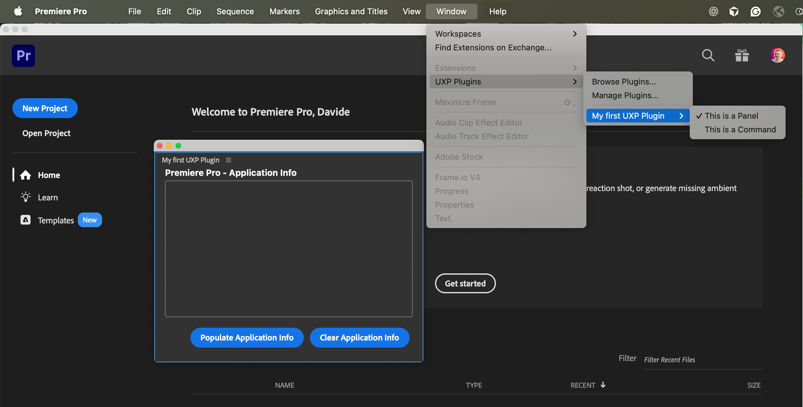

# Add a command entrypoint

A command entrypoint adds an action to the host application's plugin menu. When the user selects it, UXP runs the JavaScript handler registered for that command ID.

Use a command for a task that runs on demand and does not need a persistent interface. A command can still open a [modal dialog](../add-modal-dialogs/index.md) when it needs user input or confirmation.

In Premiere, commands appear under **Window** > **UXP Plugins** beneath the plugin name.



## 1. Declare the command

Add an entrypoint with `"type": "command"` to `manifest.json`. Give it a stable `id`; the JavaScript registration must use the same value.

```json
{
  // ...
  "entrypoints": [
    {
      "type": "command",
      "id": "myCommand",
      "label": "This is a Command"
    }
  ]
}
```

<InlineAlert slots="text1" />

The [`label`](../../explanation/concepts/manifest/index.md#label) property also accepts a [`LocalizedString`](../../explanation/concepts/manifest/index.md#localizedstring) when the command name needs localization.

## 2. Register the handler

Create the function that should run when the user selects the command:

```js
// index.js
function myCommandHandler() {
  console.log("Command invoked!");
}
```

Register the function with either `entrypoints.setup()` or `module.exports`. Choose one pattern based on the plugin's entrypoint file.

### Use `entrypoints.setup()`

Use `entrypoints.setup()` when the plugin has an HTML entrypoint or combines commands with panels and lifecycle hooks:

<CodeBlock slots="heading, code" repeat="2" languages="JavaScript, JSON" />

#### index.js

```js
const { entrypoints } = require("uxp");

function myCommandHandler() { console.log("Command invoked!"); }

entrypoints.setup({
  commands: {
    myCommand: myCommandHandler
  }
});
```

#### manifest.json

```json
{
  // ...
  "entrypoints": [
    {
      "type": "command",
      "id": "myCommand",
      "label": "This is a Command"
    }
  ]
  // ...
}
```

The `myCommand` property matches the command ID declared in `manifest.json`. See [Command handlers](../../explanation/concepts/entrypoints/index.md#command-handlers) for the broader `entrypoints.setup()` model.

<InlineAlert slots="text" variant="warning" />

Call `entrypoints.setup()` only once. Register every command, panel, and lifecycle hook in the same setup object.

### Use `module.exports`

For a command-only plugin without an HTML interface, point the manifest's `main` property directly to the JavaScript file and export the command map:

<CodeBlock slots="heading, code" repeat="2" languages="JavaScript, JSON" />

#### index.js

```js
module.exports = {
  commands: {
    myCommand: myCommandHandler
  }
};
```

#### manifest.json

```json
{
  // ...
  "main": "index.js",
  // ...
  "entrypoints": [
   {
      "type": "command",
      "id": "myCommand",
      "label": "This is a Command"
    }
  ],
  // ...
}
```
