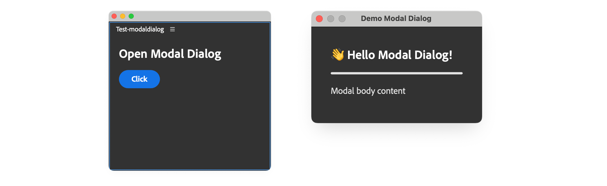
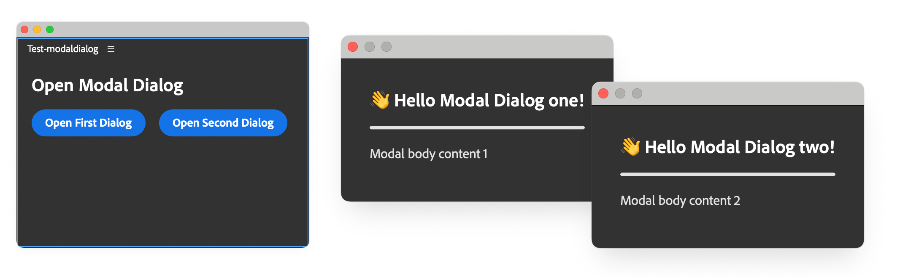
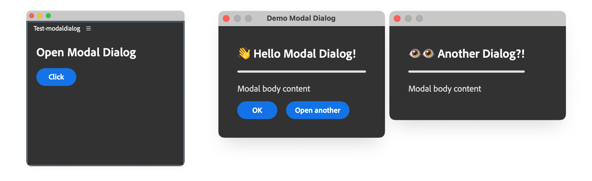
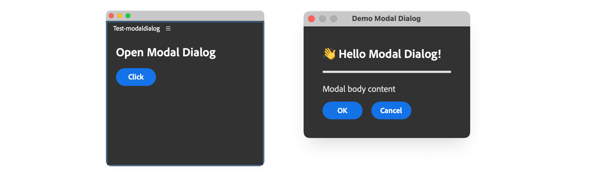
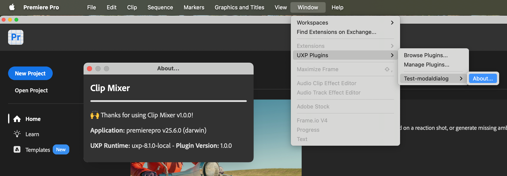
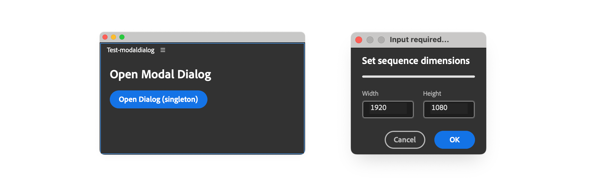

# Add modal dialogs

Use a modal dialog when your plugin needs a focused response before the user returns to the host application. Dialogs work well for confirmations, short forms, settings, and command interfaces that do not need a persistent panel.

A modal dialog blocks interaction with the host until it closes. For workflows that should remain available while the user continues working, use a [panel](../add-panels/index.md) instead.

This guide starts with a dialog opened from a panel, then covers returned values, command interfaces, external HTML, and a reusable pattern for more complex dialogs.

## How modal dialogs work

A UXP modal dialog is an HTML `<dialog>` element displayed with `uxpShowModal()`. The method returns a Promise that resolves when the dialog closes. Pass a value to `dialog.close()` when the caller needs to know how the user dismissed the dialog.

You can open a dialog from either type of entrypoint:

- **Panel:** Keep the dialog in the panel's HTML document and open it from a control such as a button.
- **Command:** Create or load the dialog when the command runs.

## Open a dialog from a panel

Add a `<dialog>` element to the panel's HTML, then call `uxpShowModal()` in response to a user action. The dialog remains hidden until the method runs.



The following example opens a dialog when the user selects a button in the main panel.

<CodeBlock slots="heading, code" repeat="2" languages="HTML, JavaScript" />

#### index.html

```html
<!DOCTYPE html>
<html>
<head>
  <script src="main.js"></script>
  <link rel="stylesheet" href="style.css" />
</head>
<body>
  <!-- Panel content -->
  <sp-heading>Open Modal Dialog</sp-heading>
  <sp-button id="openDialogBtn">Click</sp-button>

  <!-- Modal dialog content (hidden by default) -->
  <dialog>
    <sp-heading>Hello Modal Dialog!</sp-heading>
    <sp-divider size="L"></sp-divider>
    <sp-body>Modal body content</sp-body>
  </dialog>

</body>
</html>
```

#### main.js

```javascript
const openDialogBtn = document.getElementById("openDialogBtn");
openDialogBtn.addEventListener("click", () => {
  const dialog = document.querySelector("dialog");
  dialog.uxpShowModal({
    title: "Demo Modal Dialog",
    resize: "none",
    size: { width: 300, height: 300 },
  });
});
```

### Configure size and behavior

Pass an options object to `uxpShowModal()` to control the title, dimensions, and resize behavior:

| Property            | Type                                                   | Description                                    |
| :------------------- | :------------------------------------------------------ | :------------------------------------------------ |
| **title**           | string                                                 | The title of the dialog                        |
| **titleVisibility** | `"show"` \| `"none"`                                   | Whether to show the title                      |
| **resize**          | `"none"` \| `"both"` \| `"horizontal"` \| `"vertical"` | Whether to allow the user to resize the dialog |
| **size**            | `{ width: number; height: number; }`                   | The size of the dialog                         |
| **minSize**         | `{ width: number; height: number; }`                   | The minimum size of the dialog                 |
| **maxSize**         | `{ width: number; height: number; }`                   | The maximum size of the dialog                 |

## Open multiple or chained dialogs

One document can contain multiple `<dialog>` elements. Give each dialog a unique `id`, then select and open it independently with `uxpShowModal()`.



Because the dialogs are modal, users can interact with only the active dialog.

<CodeBlock slots="heading, code" repeat="2" languages="HTML, JavaScript" />

#### index.html

```html
<!DOCTYPE html>
<html>
<head>
  <script src="main.js"></script>
  <link rel="stylesheet" href="style.css" />
</head>
<body>

  <sp-heading>Open Modal Dialog</sp-heading>
  <sp-button-group>
    <sp-button id="openFirstDialogBtn">Open First Dialog</sp-button>
    <sp-button id="openSecondDialogBtn">Open Second Dialog</sp-button>
  </sp-button-group>

  <!-- First modal -->
  <dialog id="modal1">
    <sp-heading>Hello Modal Dialog!</sp-heading>
    <sp-divider size="L"></sp-divider>
    <sp-body>Modal body content 1</sp-body>
  </dialog>

  <!-- Second modal -->
  <dialog id="modal2">
    <sp-heading>Hello Another Modal Dialog!</sp-heading>
    <sp-divider size="L"></sp-divider>
    <sp-body>Modal body content 2</sp-body>
  </dialog>

</body>
</html>
```

#### main.js

```javascript
const modal1 = document.getElementById("modal1");
const modal2 = document.getElementById("modal2");

document.querySelector("#openFirstDialogBtn")
  .addEventListener("click", () => {
    modal1.uxpShowModal({ /* ... options ... */ });
  });

document.querySelector("#openSecondDialogBtn")
  .addEventListener("click", () => {
    modal2.uxpShowModal({ /* ... options ... */ });
});
```

You can also open one modal dialog from another. Add the trigger and event handler to the first dialog, then call `uxpShowModal()` on the second. Both dialogs remain open, but the first stays blocked until the second closes.



## Return a result when the dialog closes

Call `close()` on the dialog element to dismiss it programmatically. Pass an optional value to tell the caller which action the user took.

The following example returns `"ok"` or `"cancel"` from two dialog buttons:



Make the handler that opens the dialog asynchronous, then use `await` when calling `uxpShowModal()`. The Promise resolves with the value passed to `close()`.

<CodeBlock slots="heading, code" repeat="2" languages="HTML, JavaScript" />

#### index.html

```html
<!DOCTYPE html>
<html>
<head>
  <script src="main.js"></script>
  <link rel="stylesheet" href="style.css" />
</head>

<body>
  <sp-heading>Open Modal Dialog</sp-heading>
  <sp-button id="openDialogBtn">Click</sp-button>

  <dialog>
    <sp-heading>Hello Modal Dialog!</sp-heading>
    <sp-divider size="L"></sp-divider>
    <sp-body>Modal body content</sp-body>
    <sp-button-group>
      <sp-button id="closeDialogBtn">OK</sp-button>
      <sp-button id="cancelDialogBtn">Cancel</sp-button>
    </sp-button-group>
  </dialog>

</body>
</html>
```

#### main.js

```javascript
const dialog = document.querySelector("dialog");

dialog?.querySelector("#closeDialogBtn")
  ?.addEventListener("click", () => {
    dialog.close("ok");
  });
dialog?.querySelector("#cancelDialogBtn")
  ?.addEventListener("click", () => {
    dialog.close("cancel");
  });

document
  .querySelector("#openDialogBtn")
  ?.addEventListener("click", async () => {
    const result = await dialog?.uxpShowModal({
      title: "Demo Modal Dialog",
      resize: "none",
      size: { width: 300, height: 300 },
    });
    console.log("Dialog closed with:", result);
  });
```

<InlineAlert variant="warning" slots="heading, text" />

Handle window dismissal

When a user closes the dialog through its title bar or presses **Esc**, `uxpShowModal()` resolves with `"reasonCanceled"`. Handle this value alongside your explicit cancel action.

## Open a dialog from a command

Use a modal dialog when a command needs more interface than `alert()`, `prompt()`, or `confirm()` can provide. The following example creates an About dialog when its command runs.



### Create an About dialog

<CodeBlock slots="heading, code" repeat="2" languages="JavaScript, JSON" />

#### main.js

```javascript
const { entrypoints, host, versions } = require("uxp");
const manifest = require("./manifest.json");
const os = require("os");

entrypoints.setup({
  commands: {
    "about-command": async () => {
      // Create the dialog dynamically (or load from an HTML file)
      const dialog = document.createElement("dialog");
      dialog.innerHTML = `
        <sp-heading>Clip Mixer</sp-heading>
        <sp-divider size="L"></sp-divider>
        <sp-body>Thanks for using Clip Mixer v${manifest.version}!</sp-body>
        <sp-body><b>Application:</b> ${host.name} v${
        host.version
      } (${os.platform()})</sp-body>
        <sp-body><b>UXP Runtime:</b> ${versions.uxp} - <b>Plugin Version:</b> ${
        versions.plugin
      }</sp-body>
      `.trim();
      // trim is a safety measure to avoid whitespace issues

      document.body.appendChild(dialog);

      // Add styles programmatically using element.style
      dialog.style.color = "white";
      dialog.style.padding = "16px";
      dialog.querySelector("sp-divider").style.margin = "0 0 16px 0";
      dialog.querySelector("sp-heading").style.margin = "0 0 16px 0";

      // Show modal
      await dialog.uxpShowModal({
        title: "Command Modal Dialog",
        resize: "none",
        size: { width: 300, height: 200 },
      });
    },
  },
});
```

#### manifest.json

```json
{
  "id": "Test-modaldialog",
  "name": "Test-modaldialog",
  "version": "1.0.0",
  "main": "main.js",
  "host": { "app": "premierepro", "minVersion": "25.6.0" },
  "manifestVersion": 5,
  "entrypoints": [
    {
      "id": "about-command",
      "type": "command",
      "label": "About..."
    }
  ]
}
```

The `about-command` ID appears in both `manifest.json` and `entrypoints.setup()`. The command handler creates the `<dialog>`, adds it to the document, and opens it. See [Panels and Commands](../../explanation/concepts/panels-and-commands/index.md#commands) for the entrypoint model and [Add Commands](../add-commands/index.md) for more command examples.

This example builds the entire interface in JavaScript. For larger dialogs, move the markup and styles into separate files as shown in the next section.

<InlineAlert variant="info" slots="heading, text" />

Trim template literals

Call `trim()` before assigning a template literal to `dialog.innerHTML`. Leading or trailing whitespace can create text nodes that add unexpected space around the dialog content.

## Load dialog markup from an external file

For a larger interface, store the dialog markup in its own HTML file. Load it with `fetch()`, read the response as text, and assign the result to `dialog.innerHTML`:

<CodeBlock slots="heading, code" repeat="2" languages="JavaScript, HTML" />

#### main.js

```javascript
const { entrypoints, host, versions } = require("uxp");
const manifest = require("./manifest.json");
const os = require("os");

entrypoints.setup({
  commands: {
    "about-command": async () => {
      const dialogHtml = await fetch("./_dialog.html")
        .then((response) => response.text());
      const dialog = document.createElement("dialog");
      dialog.innerHTML = dialogHtml.trim();
      // ...
      // Replace placeholders with current values.
      dialog.querySelector("#version").textContent = manifest.version;
      dialog.querySelector("#app-name").textContent = host.name;
      dialog.querySelector("#app-version").textContent = host.version;
      dialog.querySelector("#platform").textContent = os.platform();
      dialog.querySelector("#uxp-version").textContent = versions.uxp;
      dialog.querySelector("#plugin-version").textContent = versions.plugin;
      // ...
      document.body.appendChild(dialog);
      // ...
      const result = await dialog.uxpShowModal({ /* ... */ });
    }
  }
});
```

#### \_dialog.html

```html
<sp-heading>Clip Mixer</sp-heading>
<sp-divider size="L"></sp-divider>
<sp-body>Thanks for using Clip Mixer v<span id="version"></span>!</sp-body>
<sp-body><b>Application:</b> <span id="app-name"></span> v<span id="app-version"></span> (<span id="platform"></span>)</sp-body>
<sp-body><b>UXP Runtime:</b> <span id="uxp-version"></span> - <b>Plugin Version:</b> <span id="plugin-version"></span></sp-body>
```

The `manifest.json` file is unchanged from the previous example.

Unlike a template literal, an external HTML file cannot interpolate JavaScript values directly. Add placeholders to the markup, select them after loading the file, and set their content programmatically.

Keep the manifest's `"main"` property set to `"main.js"`. The external HTML file supplies dialog content; it does not become the plugin entrypoint.

<InlineAlert variant="info" slots="heading, text, text2" />

Load local files

Use `require()` for local `.js` and `.json` files, such as the manifest imported by the About dialog example.

Use `fetch()` or the `fs` APIs for other local file formats.

## Reuse a complex dialog

If a plugin opens the same complex dialog repeatedly, encapsulate it in a class that creates the DOM once and reuses it. A singleton can keep dialog creation, initialization, result handling, and host-specific work separate while preventing duplicate elements and event listeners.

The following outline defines one reusable `ModalDialog` instance:

```javascript
class ModalDialog {
  static #instance;

  #dialog;
  #params;

  constructor() {
    if (ModalDialog.#instance) return ModalDialog.#instance;
    ModalDialog.#instance = this;
  }

  static getInstance() {
    if (!ModalDialog.#instance) ModalDialog.#instance = new ModalDialog();
    return ModalDialog.#instance;
  }

  async createDialog() { /* ... */ }
  initDialog() { /* ... */ }
  async runDialog() { /* ... */ }
  async #runRoutine() { /* ... */ }
}

try {
  const modalDialog = ModalDialog.getInstance();
  await modalDialog.createDialog();
  modalDialog.initDialog();
  await modalDialog.runDialog();
} catch (error) {
  console.error("Unable to run dialog:", error);
}
```

The class separates the dialog lifecycle into these responsibilities:

| Property/Method        | Description                                                                                                                                   |
| :----------------------- | :------------------------------------------------------------------------------------------------------------------------------------------------ |
| `static #instance`     | Stores the single reusable class instance.                                                                                                    |
| `#dialog`              | Stores the `<dialog>` element used internally.                                                                                                |
| `#params`              | Stores validated values collected from the interface.                                                                                        |
| `constructor()`        | Returns the existing instance when one has already been created.                                                                              |
| `static getInstance()` | Returns the existing instance or creates it on first use.                                                                                     |
| `async createDialog()` | Creates the dialog UI once and stores it in `#dialog`.                                                                                         |
| `initDialog()`         | Resets values and attaches event listeners.                                                                                                   |
| `async runDialog()`    | Opens the dialog, handles its result, and runs the requested operation.                                                                        |
| `async #runRoutine()`  | Runs host-specific logic with the values collected by the dialog.                                                                             |

### Build a complete reusable dialog

The following panel opens a reusable dialog that collects width and height values for a sequence. The host-specific operation is represented by a placeholder so the example can focus on dialog structure and validation.

```text
.
|-- fragments/
|   |-- dialog.html
|   `-- styles.css
|-- index.html
|-- style.css
|-- main.js
`-- manifest.json
```

The `fragments` directory keeps dialog markup and styles separate from the main panel files.



<CodeBlock slots="heading, code" repeat="6" languages="HTML, CSS, JavaScript, HTML, CSS, JSON" />

#### index.html

```html
<!DOCTYPE html>
<html>
<head>
  <script src="main.js"></script>
  <link rel="stylesheet" href="style.css" />
</head>

<body>
  <sp-heading>Open Modal Dialog</sp-heading>
  <sp-button id="openDialogBtn">Open Dialog (singleton)</sp-button>
</body>
</html>
```

#### style.css

```css
body { color: white; padding: 16px; }

sp-divider, sp-heading { margin: 0 0 16px 0; }
```

#### main.js

```javascript
const DIALOG_CONFIG = {
  version: "1.0.0",
  title: "Input required...",
  dialogSize: { width: 240, height: 150 },
  defaultValues: { width: 1920, height: 1080 },
  valueRange: { min: 320, max: 10240 },
};

class ModalDialog {
  static #instance; // Singleton instance
  #dialog;          // Reference to the dialog element
  // State container for validated values
  #params = { width: 0, height: 0 };

  constructor() {
    // Enforce singleton pattern
    if (ModalDialog.#instance) { return ModalDialog.#instance; }
    ModalDialog.#instance = this;
  }

  // Static getter for singleton instance (optional, cleaner API)
  static getInstance() {
    if (!ModalDialog.#instance) {
      ModalDialog.#instance = new ModalDialog();
    }
    return ModalDialog.#instance;
  }

  // Create and populate a dialog w/ HTML elements
  // Assign to #dialog
  // Uses the same pattern as styles: create once, reuse thereafter
  async createDialog() {
    // Add scoped styles to the head
    // The conditional check ensures the styles are added only once
    // to avoid duplicates when the dialog is opened multiple times
    if (!document.querySelector("#modal-dialog-styles")) {
      const styleEl = document.createElement("style");
      styleEl.id = "modal-dialog-styles";
      styleEl.textContent = (
        await fetch("./fragments/styles.css").then((res) => res.text())
      ).trim();
      document.head.appendChild(styleEl);
    }

    // Same pattern for the dialog: create once, reuse thereafter
    if (!document.querySelector("#modal-dialog")) {
      this.#dialog = document.createElement("dialog");
      this.#dialog.id = "modal-dialog";
      // Add unique class for scoping the CSS
      this.#dialog.classList.add("modal-dialog");
      this.#dialog.innerHTML = (
        await fetch("./fragments/dialog.html").then((res) => res.text())
      ).trim();
      document.body.appendChild(this.#dialog);
    } else {
      // Reuse existing dialog
      this.#dialog = document.querySelector("#modal-dialog");
    }
  }

  initDialog() {
    const widthField = this.#dialog.querySelector("#width");
    const heightField = this.#dialog.querySelector("#height");

    // Reset to the default values each time the dialog opens.
    widthField.value = DIALOG_CONFIG.defaultValues.width.toString();
    heightField.value = DIALOG_CONFIG.defaultValues.height.toString();

    // Attach event listeners only once because the dialog is reused.
    if (!this.#dialog.dataset.listenersAttached) {
      // Sanitize input for the textfields
      const sanitizeInput = (evt) => {
        /* ... */
      };
      widthField.addEventListener("input", sanitizeInput);
      heightField.addEventListener("input", sanitizeInput);

      // Validate and return params object if valid, null if invalid
      const validateAndGetParams = () => {
        const width = parseInt(widthField.value, 10);
        const height = parseInt(heightField.value, 10);
        if (
          Number.isNaN(width) || Number.isNaN(height) ||
          width < DIALOG_CONFIG.valueRange.min ||
          width > DIALOG_CONFIG.valueRange.max ||
          height < DIALOG_CONFIG.valueRange.min ||
          height > DIALOG_CONFIG.valueRange.max
        ) {
          return null;
        }
        return { width, height };
      };

      this.#dialog
        .querySelector("#okDialogBtn")
        .addEventListener("click", () => {
          const params = validateAndGetParams();
          if (params) {
            // Store validated params for use in #runRoutine
            this.#params = params;
            this.#dialog.close("ok");
          } else {
            // alert the user that the parameters are invalid
            alert("Invalid parameters");
          }
        });
      this.#dialog
        .querySelector("#cancelDialogBtn")
        .addEventListener("click", () => {
          this.#dialog.close("cancel");
        });

      this.#dialog.addEventListener("keydown", (event) => {
        if (event.key === "Enter") {
          const params = validateAndGetParams();
          if (params) {
            this.#params = params;
            this.#dialog.close("ok");
          }
        }
      });

      // Mark the dialog element itself as having listeners attached
      this.#dialog.dataset.listenersAttached = "true";
    }
  }

  async runDialog() {
    const result = await this.#dialog.uxpShowModal({
      title: DIALOG_CONFIG.title,
      resize: "none",
      size: DIALOG_CONFIG.dialogSize,
    });

    if (result === "ok") {
      console.log("Dialog closed with OK");
      const completed = await this.#runRoutine();
      if (!completed) throw new Error("Dialog routine failed");
      return true;
    }

    if (result === "cancel" || result === "reasonCanceled") {
      return false;
    }

    throw new Error(`Unexpected dialog result: ${result}`);
  }

  // Run whatever Host App DOM code is needed
  // Has access to validated params via this.#params
  async #runRoutine() {
    console.log("Running PPro routine with params:", this.#params);
    //... perform the (fictitious) routine using
    // this.#params.width and this.#params.height
    return true;
  }

  // Getter to access validated params (if needed by external code)
  getParams() {
    // Return a copy to prevent external mutation
    return { ...this.#params };
  }
}

const openDialogButton = document.querySelector("#openDialogBtn");
if (openDialogButton && !openDialogButton.dataset.listenerAttached) {
  openDialogButton.addEventListener("click", async () => {
    try {
      const modalDialog = ModalDialog.getInstance();
      await modalDialog.createDialog();
      modalDialog.initDialog();
      await modalDialog.runDialog();
    } catch (error) {
      console.error("Unable to run dialog:", error);
    }
  });
  openDialogButton.dataset.listenerAttached = "true";
}
```

#### fragments/dialog.html

```html
<div class="wrapper">
  <sp-heading size="S">Set sequence dimensions</sp-heading>
  <sp-divider size="L"></sp-divider>
  <div class="row spaced">
    <sp-textfield id="width" type="number">
      <sp-label slot="label">Width</sp-label>
    </sp-textfield>
    <sp-textfield id="height" type="number">
      <sp-label slot="label">Height</sp-label>
    </sp-textfield>
  </div>
  <sp-button-group>
    <sp-button variant="secondary" id="cancelDialogBtn">
      Cancel
    </sp-button>
    <sp-button variant="cta" id="okDialogBtn">
      OK
    </sp-button>
  </sp-button-group>
</div>
```

#### fragments/styles.css

```css
/* Everything is scoped for the modal dialog only */
dialog.modal-dialog { padding: 0; }

dialog.modal-dialog .wrapper {
  min-height: 100vh; overflow: hidden;
  padding: 10px 20px; display: flex; flex-direction: column;
}

dialog.modal-dialog .row {
  display: flex; flex-direction: row; justify-content: space-between;
}

dialog.modal-dialog .spaced { margin-bottom: 16px; }

dialog.modal-dialog sp-textfield {
  display: flex; width: 92px; margin-bottom: 6px;
}

dialog.modal-dialog sp-button-group {
  display: flex; flex-direction: row; justify-content: flex-end;
}
```

#### manifest.json

```json
{
  "id": "Test-modaldialog",
  "name": "Test-modaldialog",
  "version": "1.0.0",
  "main": "index.html",
  "host": { "app": "premierepro", "minVersion": "25.6.0" },
  "manifestVersion": 5,
  "requiredPermissions": { "localFileSystem": "request" },
  "featureFlags": { "enableAlerts": true },
  "entrypoints": [
    {
      "id": "starterpanel",
      "type": "panel",
      "minimumSize": { "width": 430, "height": 500 },
      "maximumSize": { "width": 2000, "height": 2000 },
      "preferredDockedSize": { "width": 230, "height": 300 },
      "preferredFloatingSize": { "width": 400, "height": 300 },
      "label": { "default": "PremierePro Modal Dialog" },
      "icons": [
        {
          "width": 23, "height": 23, "path": "icons/dark.png",
          "scale": [ 1, 2 ], "theme": [ "darkest", "dark", "medium" ]
        },
        {
          "width": 23, "height": 23, "path": "icons/light.png",
          "scale": [ 1, 2 ], "theme": [ "lightest", "light" ]
        }
      ]
    }
  ],
  "icons": [
    {
      "width": 48, "height": 48, "path": "icons/plugin-icon.png",
      "theme": [
        "darkest", "dark", "medium", "lightest", "light", "all"
      ],
      "species": [ "pluginList" ], "scale": [ 1, 2 ]
    }
  ]
}
```

### How the example is organized

The example separates the main panel, dialog fragments, and dialog behavior so each part has one responsibility.

#### Panel and manifest

`index.html` and `style.css` define the panel that opens the dialog. The manifest declares the panel entrypoint and enables `alert()`, which reports invalid input.

#### Dialog markup and styles

`fragments/dialog.html` contains the fields and buttons. Its outer `<div>` provides the content for the `<dialog>` element created in `main.js`. The selectors in `fragments/styles.css` begin with `dialog.modal-dialog` so they do not affect the main panel.

#### Dialog behavior

`main.js` divides the lifecycle across focused methods:

- `createDialog()` loads the fragments and creates the dialog only once.
- `initDialog()` resets field values and attaches event listeners only once.
- `runDialog()` opens the dialog, handles its result, and runs the operation after a valid confirmation.
- `#runRoutine()` contains the host-specific work that uses the validated values.
- `getParams()` returns a copy of the collected values without exposing private state.

The button handler retrieves the singleton, creates the dialog if necessary, initializes its state, and opens it. A normal cancellation returns `false`; unexpected failures are reported through the `catch` block.
