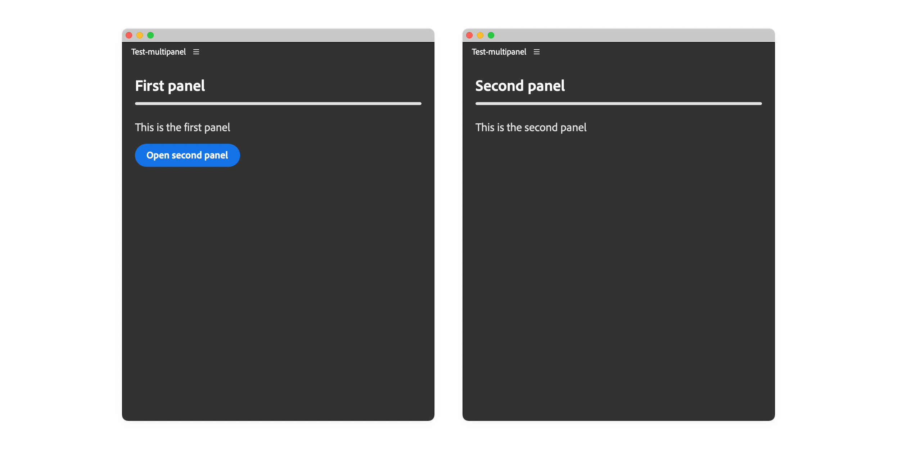

# Add multiple panels

A UXP plugin can expose multiple panels for separate tasks, such as a main workspace and a settings view. Each panel appears as its own menu item in the host application and has its own entrypoint, size constraints, and lifecycle.

This guide builds a two-panel plugin in which the first panel opens the second. Both panels initially share one HTML document and JavaScript context. A later section shows how to load the second panel's markup from a separate file.



## How multiple panels work

Building a multi-panel plugin requires four pieces:

1. Declare one panel entrypoint for each panel in `manifest.json`.
2. Create a separate content container for each panel.
3. Register lifecycle hooks that attach the correct content when a panel opens.
4. Use the Plugin Manager when one panel needs to open another programmatically.

## Before you begin

<InlineAlert variant="info" slots="heading, text"/>

IPC Permission

This example opens the second panel through the Plugin Manager, so the manifest must include the `ipc` (inter-plugin communication) permission. The complete manifest in the next step includes it.

<InlineAlert variant="warning" slots="heading, text"/>

Known Limitation

The `hide()` lifecycle hook is not reliable in every host. In Premiere, for example, hiding a panel may not trigger its `hide()` callback. Do not depend on `hide()` for essential cleanup, and check your target host's release notes for current behavior.

## 1. Declare the panel entrypoints

In `manifest.json`, declare one entrypoint for each panel and enable the IPC permission used for programmatic panel control:

```json
{
  "id": "multi-panel-demo",
  "name": "Multi Panel Demo",
  "version": "1.0.0",
  "main": "index.html",
  "host": { "app": "premierepro", "minVersion": "25.6.0" },
  "manifestVersion": 5,
  "requiredPermissions": {
    "ipc": { "enablePluginCommunication": true }
  },
  "entrypoints": [
    {
      "id": "uxp-first-panel",
      "type": "panel",
      "label": { "default": "First Panel" },
      "minimumSize": { "width": 430, "height": 500 },
      "preferredDockedSize": { "width": 230, "height": 300 }
    },
    {
      "id": "uxp-second-panel",
      "type": "panel",
      "label": { "default": "Second Panel" },
      "minimumSize": { "width": 430, "height": 500 },
      "preferredDockedSize": { "width": 230, "height": 300 }
    }
  ]
}
```

Both panels now appear under **Window** > **UXP Plugins** > **Multi Panel Demo**.

## 2. Add the panel markup

In `index.html`, create a wrapper for each panel. Give the second wrapper an `id` so its lifecycle hook can find and attach it later:

```html
<!DOCTYPE html>
<html>
<head>
  <script src="main.js"></script>
  <link rel="stylesheet" href="style.css" />
</head>
<body>
  <!-- First panel content -->
  <div class="wrapper">
    <sp-heading>First Panel</sp-heading>
    <sp-divider size="L"></sp-divider>
    <sp-body>
      This is the first panel.
    </sp-body>
    <sp-button id="open-second-panel">Open Second Panel</sp-button>
  </div>

  <!-- Second panel content -->
  <div class="wrapper" id="second-panel">
    <sp-heading>Second Panel</sp-heading>
    <sp-divider size="L"></sp-divider>
    <sp-body>
      This is the second panel.
    </sp-body>
  </div>
</body>
</html>
```

The first panel's content remains in the document body. The second panel's content is moved into the root node supplied to its `show()` hook.

<InlineAlert variant="info" slots="text"/>

The wrapper `id` in `index.html` does not need to match the panel entrypoint `id` in `manifest.json`. The wrapper identifies a DOM element; the entrypoint ID identifies a UXP panel.

## 3. Register the lifecycle hooks

Use the panel [lifecycle hooks](../../explanation/concepts/entrypoints/index.md#panel-lifecycle-hooks) in `main.js` to attach the second panel's content when the host shows it. Store the plugin ID during `create()` so the first panel can find the current plugin through `pluginManager`:

```javascript
const { entrypoints, pluginManager } = require("uxp");

// Get reference to the second panel container
const secondPanel = document.querySelector("#second-panel");
let pluginId;

entrypoints.setup({
  plugin: {
    create() {
      pluginId = this.id;
      console.log("Plugin created:", pluginId);
    },
  },
  panels: {
    "uxp-first-panel": {
      create() { console.log("First panel created") },
      show() {
        console.log("First panel shown");
        // The first panel content is already in the document body.
      },
    },
    "uxp-second-panel": {
      create() { console.log("Second panel created") },
      show(body) {
        body.appendChild(secondPanel);
        console.log("Second panel shown");
      },
      hide(body) {
        // Do not rely on this hook for essential cleanup in every host.
        body.removeChild(secondPanel);
        console.log("Second panel hidden");
      },
    },
  },
});

// Add button handler to open the second panel via IPC
document.querySelector("#open-second-panel")
  .addEventListener("click", () => {
    const me = [...pluginManager.plugins].find(
      (plugin) => plugin.id === pluginId
    );
    me?.showPanel("uxp-second-panel");
});
```

When the second panel opens, UXP passes its root node to `show(body)`. The handler appends `secondPanel` to that root. The button in the first panel then finds the current plugin and calls `showPanel()` with the second entrypoint's ID. See [Communicate between plugins](../inter-plugin-comm/index.md) for more about the Plugin Manager.

<InlineAlert variant="info" slots="text"/>

The API can open a panel programmatically, but it cannot close one. Users must close panels through the host application's interface.

## Share state between panels

Panels backed by the same HTML document also share a JavaScript context. They can exchange state through shared variables, function calls, or events without using IPC.

## Load panel markup from another file

For larger panels, keep each panel's markup in a separate file. Fetch the second panel's HTML, then inject it into the wrapper before the panel opens:

<CodeBlock slots="heading, code" repeat="3" languages="HTML, HTML, JavaScript" />

#### index.html

```html
<!DOCTYPE html>
<html>
<head>
  <script src="main.js"></script>
  <link rel="stylesheet" href="style.css" />
</head>
<body>
  <!-- First panel content -->
  <div class="wrapper">
    <sp-heading>First Panel</sp-heading>
    <sp-divider size="L"></sp-divider>
    <sp-body>
      This is the first panel.
    </sp-body>
    <sp-button id="open-second-panel">Open Second Panel</sp-button>
  </div>

  <!-- Second panel wrapper -->
  <div class="wrapper" id="second-panel">
    <!-- nothing here yet -->
  </div>
</body>
</html>

```

#### second-panel.html

```html
<!-- This is what used to be inside the second panel's <div> wrapper -->
<sp-heading>Second Panel</sp-heading>
<sp-divider size="L"></sp-divider>
<sp-body>
  This is the second panel.
</sp-body>
```

#### main.js

```javascript
const { entrypoints, pluginManager } = require("uxp");

// Get reference to the second panel container
const secondPanel = document.querySelector("#second-panel");

// Fetch the second panel's HTML file and inject the content into the DOM
fetch("./second-panel.html")
  .then(response => response.text())
  .then(html => {
    secondPanel.innerHTML = html;
    // Add event listeners for the second panel here
    // or any other JavaScript code you need
  });

let pluginId;
entrypoints.setup({ /* ... */ });

// Everything else is the same as in the previous example...
```

The `manifest.json` is unchanged from the previous example.

The manifest and lifecycle setup remain the same. This pattern keeps `index.html` smaller as each panel grows more complex.
