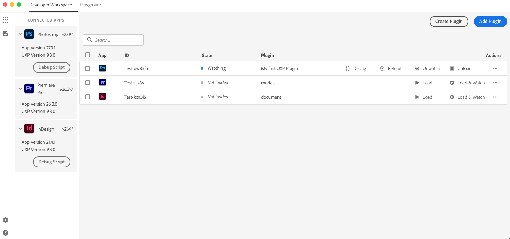

# Set Up Developer Tools

Building a UXP plugin takes two tools: a code editor to write it, and the UXP Developer Tool (UDT) to load it into your host application, reload it as you make changes, and debug it. Let's get both installed.

## Code Editor

A reliable code editor helps you stay organized and productive. Any modern editor works. [Visual Studio Code](https://code.visualstudio.com) is a safe default: it's free, with a strong extension ecosystem, built-in formatting and linting, and a good fit for UXP workflows.

Once you've picked an editor, set up [autocomplete and type checking](../typescript/index.md) and [ESLint linting](../eslint/index.md) for UXP so mistakes surface as you type. Neither is required to start, but both pay off quickly.

## UXP Developer Tool (UDT)

The UXP Developer Tool (UDT) simplifies creating, loading, managing, and debugging plugins for Adobe's UXP-powered applications.

In addition, the UXP Developer Tool:

- Includes a **Code Playground** to quickly test and explore APIs.
- Lets you **package plugins** into a `.ccx` [installable file](../distribution/package/index.md), ready for distribution.
- Provides **starter templates** and sample projects to help you get moving faster.

<InlineAlert variant="info" slots="heading,text"/>

Admin privileges are required to use UDT.

The UXP Developer Tool requires administrator-level privileges to run correctly. If you cannot elevate permissions on your system, you may not be able to use this tool.

### Installation

You can install UDT directly [from Creative Cloud](https://creativecloud.adobe.com/apps/download/uxp-developer-tools), or by following these steps:

1. Open the Adobe Creative Cloud desktop app. If you don't have it installed, [download and install it here](https://creativecloud.adobe.com/apps/download/creative-cloud).
2. Sign in with your Adobe ID if you haven't already.
3. Go to the **All apps** section and search for "UXP Developer Tools".
4. Click **Install** on the UXP Developer Tools card.

   

<InlineAlert variant="warning" slots="text"/>

The UXP Developer Tool is not yet available as a Package in the Adobe **Admin Console** for Team and Enterprise customers.

## Enable Developer Mode

The first time you launch UDT, it asks you to enable Developer Mode. This is required to load plugins in development into your host application. Click **Enable**; elevated permissions will be requested, and you may need to enter your password or approve an action.

- Manual configuration steps:
  1. Quit the UXP Developer Tool.
  2. Navigate to `/Library/Application Support/Adobe/UXP/Developer` on macOS, or `%CommonProgramFiles%/Adobe/UXP/Developer` on Windows (create the folder if needed).
  3. Create a file named `settings.json` containing `{ "developer": true }`.
  4. Launch the UXP Developer Tool again.

## Next step

Your tools are ready. Now [build your first plugin](../../tutorials/build-your-first-plugin/index.md).
