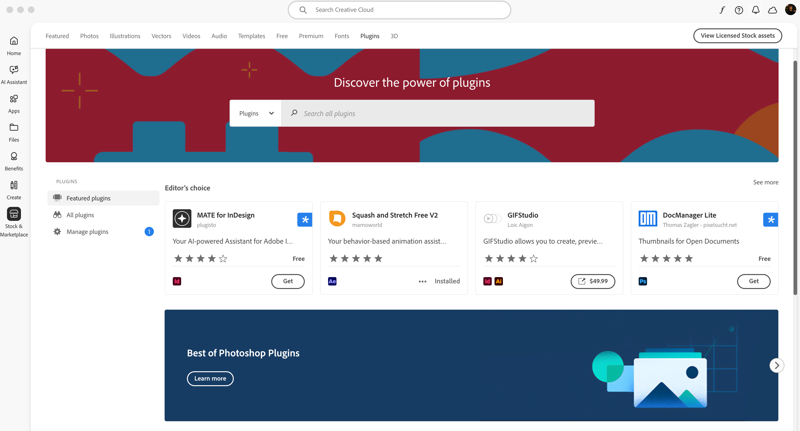

<Superhero slots="heading, text" variant="centered" textColor="white" background="linear-gradient(135deg, #30186E 0%, #6432C8 100%)"/>

# Adobe Creative Cloud Marketplace

Publish a free or paid plugin for discovery and installation through Creative Cloud Desktop.

## What Marketplace provides

- Discovery by Adobe Creative Cloud users.
- Review by the Extensibility Review team.
- Access to current plugin versions through Creative Cloud Desktop.
- Integrated commerce through [FastSpring](https://fastspring.com/).
  - Acts as a **Merchant of Records** (MoR) for the EU region, collecting and remitting VAT on your behalf.
  - Supports free or paid **perpetual products and subscriptions**.
  - **10% flat fee** on all transactions.
  - Sales are paid out as **Royalties** on software purchases.
- Non-exclusive distribution, provided Marketplace and external packages use the appropriate [plugin IDs](../package/index.md#multi-channel-distribution).

## Publish to Marketplace

1. [Package the plugin](../package/index.md) with the Marketplace plugin ID.
2. [Create a listing](../listing/index.md) with its metadata, assets, and `.ccx` package.
3. Check the [review guidelines](../review-guidelines/index.md) before submitting.

After approval, the listing becomes available through Creative Cloud Marketplace and Creative Cloud Desktop.
