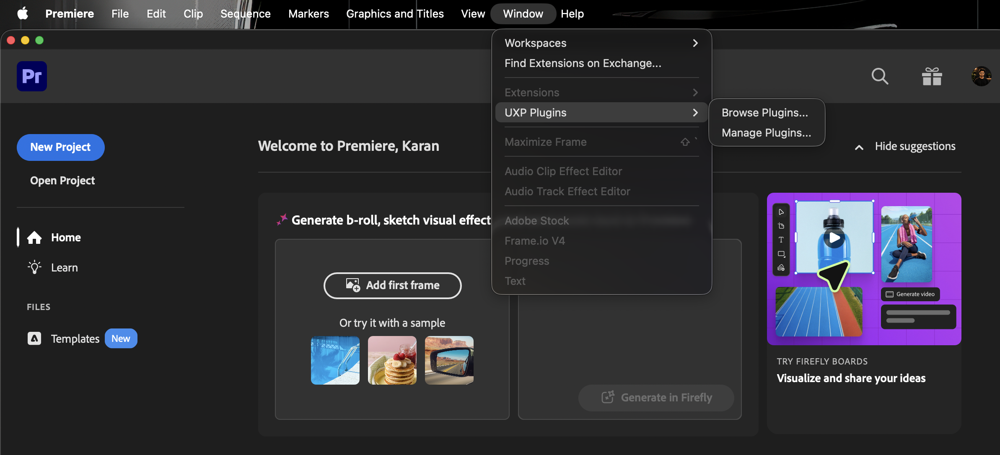
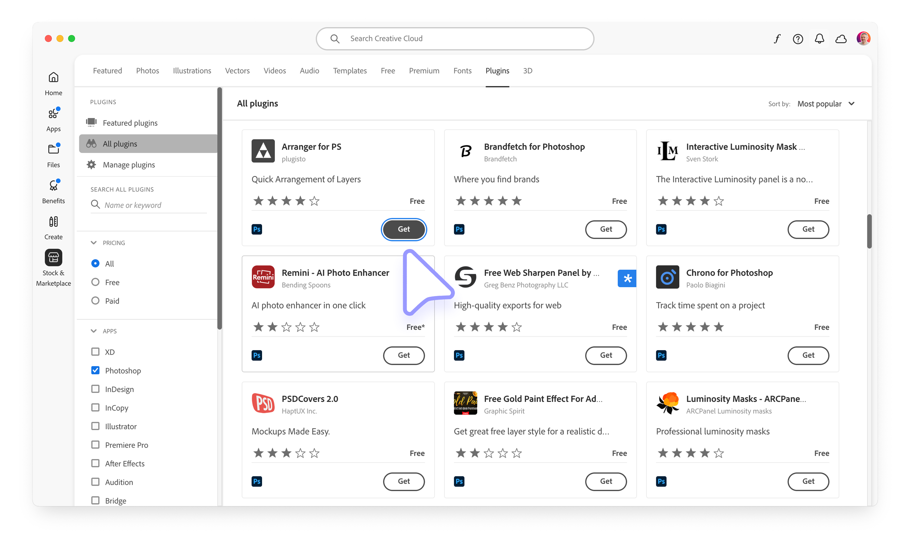
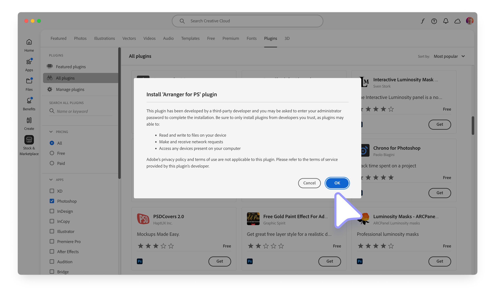
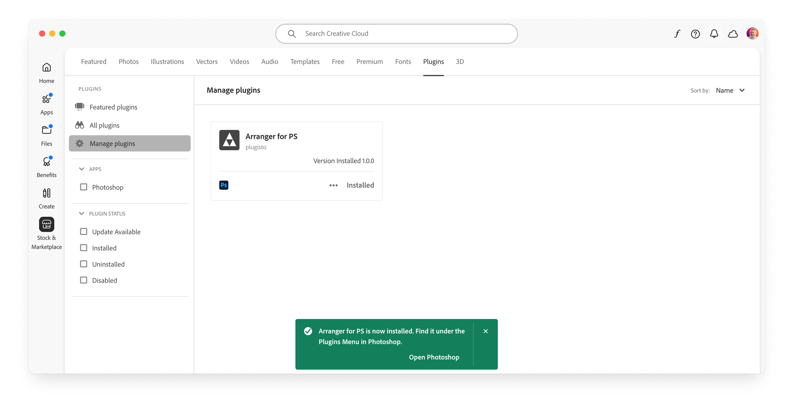
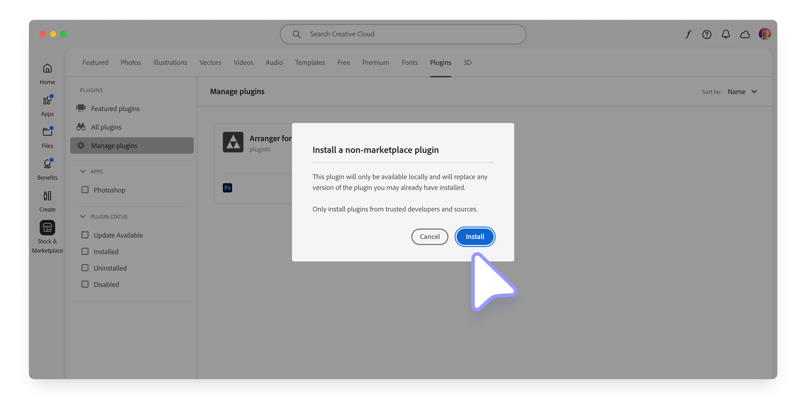
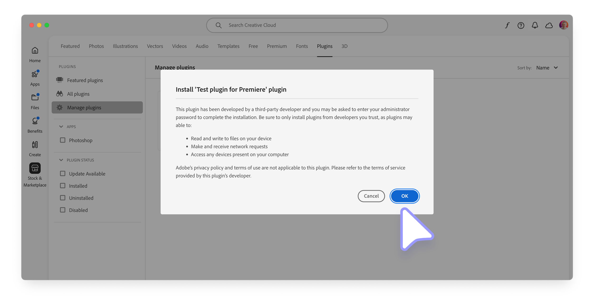
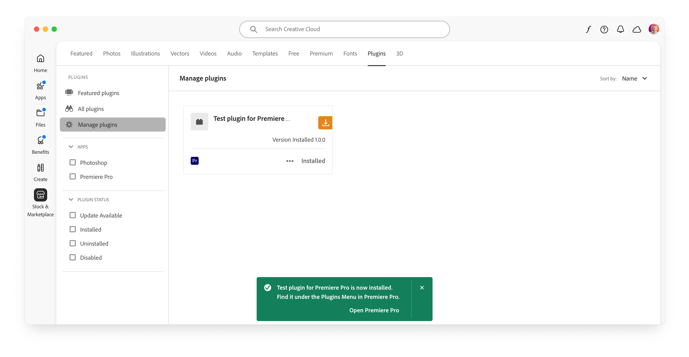
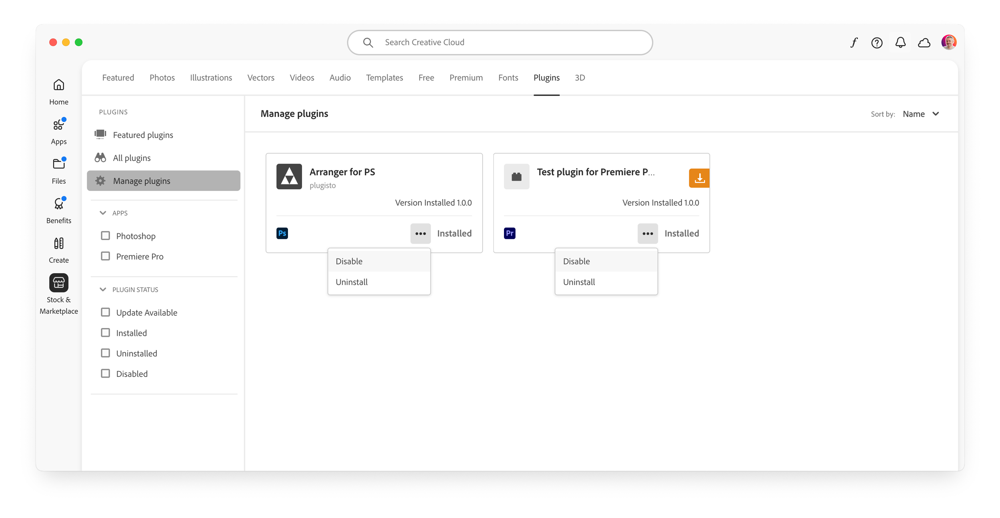

# Install a UXP plugin

Choose the installation method that matches the plugin's distribution channel. Creative Cloud Desktop handles Marketplace and `.ccx` installations; administrators can also use UPIA for managed deployment.

<InlineAlert slots="heading, text" variant="warning"/>

Development loading

To load and debug an unpackaged project, enable [Developer Mode](../../developer-tools/index.md#enable-developer-mode) in both UDT and the host application. End users installing a packaged plugin do not use this development workflow.

## Choose an installation method

| Distribution channel | Installation method |
| :--- | :--- |
| **Creative Cloud Marketplace** | Install through [Creative Cloud Desktop](#use-the-creative-cloud-marketplace). |
| **Independent `.ccx` package** | Double-click the [`.ccx` installer](#use-a-ccx-installer-file) or use [UPIA](#use-the-upia-tool). |
| **Enterprise** | Deploy through [Admin Console](../enterprise-distribution/index.md) or [UPIA](#use-the-upia-tool). |

In Premiere, installed plugins appear under **Window** > **UXP Plugins**.



## Use the Creative Cloud Marketplace

In Creative Cloud Desktop, open **Stock & Marketplace**, then select the **Plugins** tab.

1. Find the plugin and select **Get**.



2. Review the permissions declared by the [plugin manifest](../../../explanation/concepts/manifest/index.md#permissionsdefinition), then select **OK**.



3. Confirm that the plugin appears under **Manage Plugins** and in the host application.



## Use a `.ccx` installer file

To install a package obtained outside Marketplace:

1. Double-click the `.ccx` file to open Creative Cloud Desktop.
2. Review the warning for packages from outside Marketplace, then select **Install**.



3. Review any [required permissions](../../../explanation/concepts/manifest/index.md#requiredpermissions). Some packages may request administrative privileges.



4. Confirm that the plugin appears under **Manage Plugins** and in the host application.



If the installation fails, click the Details link on the red toast to open the Logs and check the error message. See [Troubleshooting](#troubleshooting) for more details.

## Uninstall or disable a plugin

In Creative Cloud Desktop, open **Manage Plugins**, open the plugin's **Actions** (`•••`) menu, and choose:

- **Disable** to remove the plugin from the host while keeping it installed.
- **Uninstall** to remove the installed package.



<InlineAlert variant="info" slots="text, text2"/>

Creative Cloud Desktop distinguishes Marketplace plugins from packages installed through a `.ccx` file, which display an orange download icon.

When you uninstall a plugin that was installed from the Marketplace, it's removed from the host application but **remains visible** in the Manage Plugins tab. This is because you still have the right to reinstall it at any time. In contrast, plugins installed from a `.ccx` file **disappear entirely** from the Manage Plugins tab once uninstalled.

## Use the UPIA tool

The **Unified Plugin Installer Agent** (UPIA) is the command-line utility used by Creative Cloud Desktop to install, remove, and list plugins. See the [UPIA documentation](https://helpx.adobe.com/creative-cloud/apps/integration-with-other-apps/manage-plugins/install-plugins-using-upia-tool.html) for complete options.

The UPIA tool can **install**, **uninstall**, and **list** plugins. Here's a quick summary of the available commands.

### On macOS

Open the **Terminal** and `cd` to the UPIA executable folder. Admin privileges may be required:

```bash
cd "/Library/Application Support/Adobe/Adobe Desktop Common/RemoteComponents/UPI/UnifiedPluginInstallerAgent/UnifiedPluginInstallerAgent.app/Contents/macOS"

./UnifiedPluginInstallerAgent --help
./UnifiedPluginInstallerAgent --version
./UnifiedPluginInstallerAgent --install <extension-file-path>
./UnifiedPluginInstallerAgent --remove <extension-file-path>
./UnifiedPluginInstallerAgent --list <all || product display name>
```

Examples:

```bash
#### Examples
./UnifiedPluginInstallerAgent --install "~/Desktop/Test-xjluvc_premierepro.ccx"
./UnifiedPluginInstallerAgent --remove "startup-test"
./UnifiedPluginInstallerAgent --list all
```

### On Windows

Open **Command Prompt**, change to the UPIA executable folder, then run the command you need. Admin privileges may be required:

```powershell
cd "C:\Program Files\Common Files\Adobe\Adobe Desktop Common\RemoteComponents\UPI\UnifiedPluginInstallerAgent"

UnifiedPluginInstallerAgent.exe /help
UnifiedPluginInstallerAgent.exe /version
UnifiedPluginInstallerAgent.exe /install <extension-file-path>
UnifiedPluginInstallerAgent.exe /remove <extension-file-path>
UnifiedPluginInstallerAgent.exe /list <all || product display name>
```

Examples:

```powershell
#### Examples
UnifiedPluginInstallerAgent.exe /install "C:\Temp\Test-xjluvc_premierepro.ccx"
UnifiedPluginInstallerAgent.exe /remove "startup-test"
UnifiedPluginInstallerAgent.exe /list all
```

## Troubleshooting

If installation fails:

- It is helpful to **run the host application at least once** before installing any plugin.
- If the Creative Cloud Desktop application is not launching when you double-click on a `.ccx` file, try locating the UPIA executable and running it manually. The **file extension may not have been associated properly**, or there might be **permission issues**.
- It may happen that the UPIA executable is either corrupted or not present in the system. **Reinstalling the Creative Cloud Desktop application** may resolve the issue. If you are installing plugins in an enterprise environment, please [check here](../enterprise-distribution/index.md#2-bundle-ccx-plugins-in-managed-packages) how to include the UPIA in your package.
- Reach out to [ccintrev@adobe.com](mailto:ccintrev@adobe.com) for support. If further troubleshooting is necessary, you may be asked to run the [Log Collector tool](https://helpx.adobe.com/creative-cloud/apps/troubleshoot/diagnostics-repair-tools/run-log-collector-tool.html).
