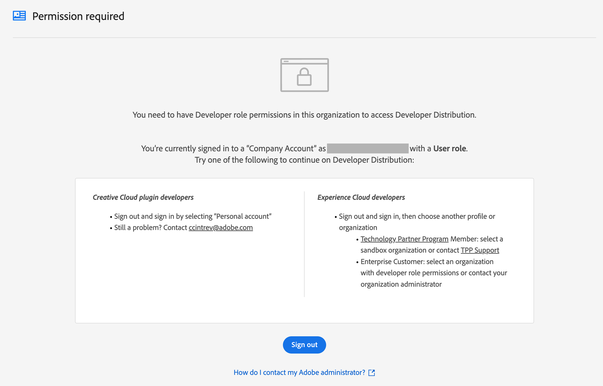
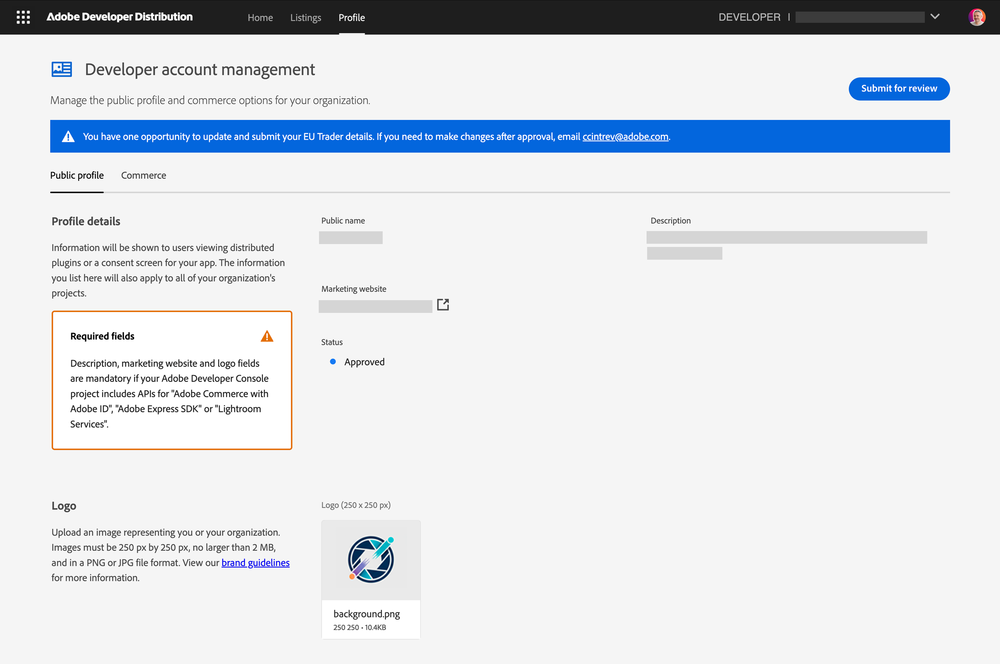
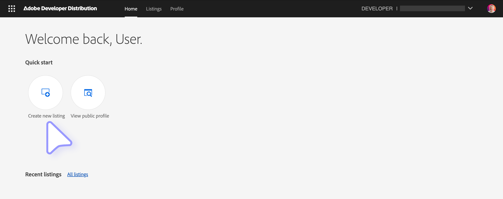
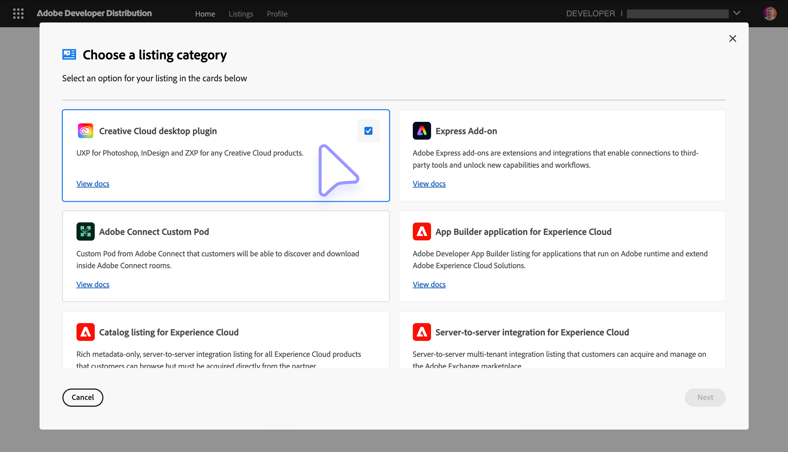
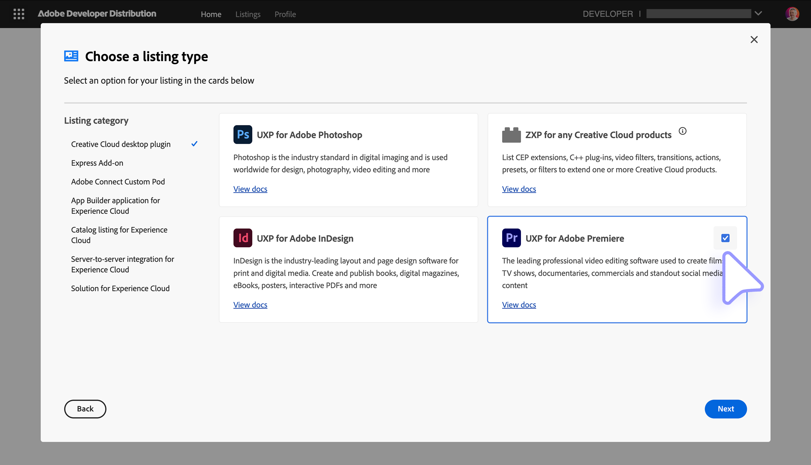
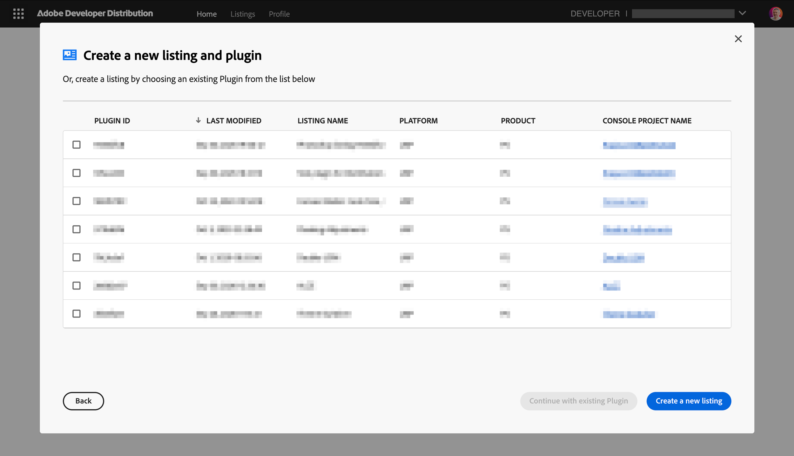
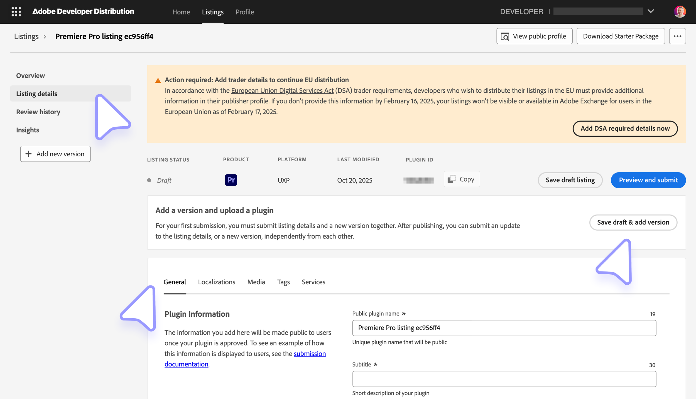
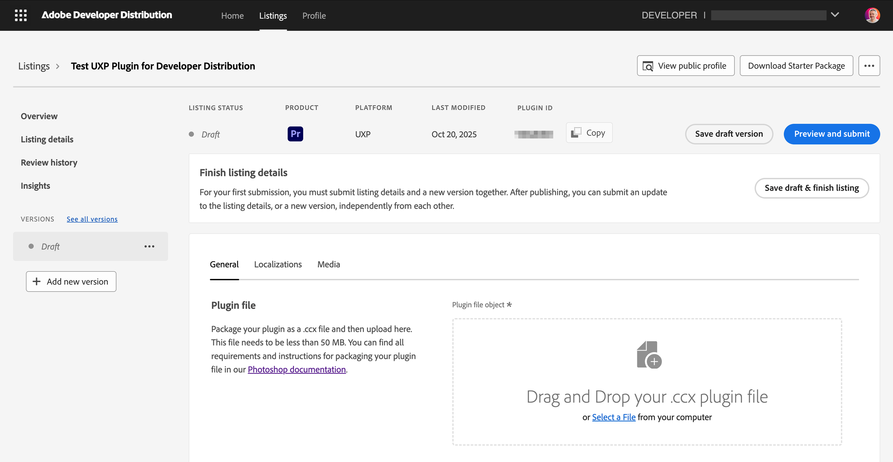
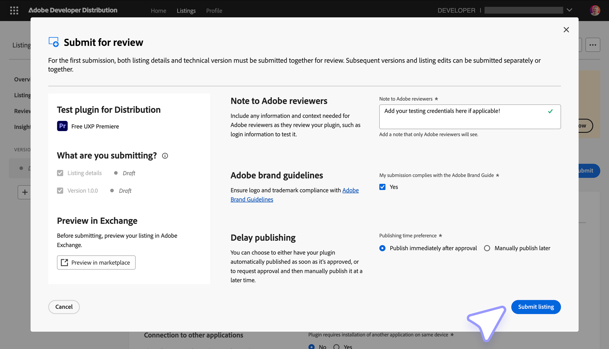

# Create a Marketplace listing

Prepare the listing content and `.ccx` package before opening Developer Distribution. Marketplace submissions go through [Adobe review](../review-guidelines/index.md) before publication.

## Preparing for Submission

### 1. Metadata

An asterisk identifies a required field.

| Name                           | Character Length |                                                                                                  Description |
| --------------------------------- | ------------------- | -----------------------------------------------------------------------------------------------------------: |
| **\* Public plugin name**      | 45               |                                                                                 A unique name for the plugin |
| **\* Subtitle**                | 30               |                                                       A subtitle that will appear in the plugin listing card |
| **\* Description**             | 5000             |                                                A full context and description of the plugin and its features |
| **\* Categories**              | NA               |                     Collaboration, Tools & Automation, Usability & Testing, Publish & Handoff, Design Assets |
| **Tags**                       | 300              |                                                              Tags to increase discoverability of the listing |
| **\* Support email**           | 1000             |                                                           Support email address to be shared with your users |
| **Help URL**                   | 1000             |                                                                               URL for your users to get help |
| **Privacy Policy URL**         | 1000             |                                                                                   URL of your Privacy Policy |
| **Terms of Service URL**       | 1000             |                                                                                 URL of your Terms of Service |
| **Purchase Method**            | NA               |                                                                      Either Free, Perpetual, or Subscription |
| **\* Trader information**      | NA               | Provide the Trader information in the Publisher Profile if you want to make your plugins available in the EU |
| **\* Version details**         | 1000             |                                                                                         Public release notes |
| **\* Supported Languages**     | 1000             |                                                                            Languages supported by the plugin |
| **\* Note to Adobe reviewers** | 1000             |                                                                                  Instructions for reviewers |

Complete every required field and verify names, links, pricing, supported languages, and release notes before submission.

<InlineAlert slots="heading, text" variant="info"/>

Testing credentials

Provide working credentials, license keys, or test accounts for every paid or restricted feature. Reviewers must be able to test the complete plugin.

### 2. Assets

| Type                       | Format           |                                                   Description |
| ------------------------------ | -------------------- | ------------------------------------------------------------: |
| **\* 48x48 icon**          | `.jpg/png` < 1MB |                        a 48x48 sized icon for the plugin card |
| **\* 96x96 icon**          | `.jpg/png` < 1MB |                        a 96x96 sized icon for the plugin card |
| **\* 192x192 icon**        | `.jpg/png` < 1MB |                      a 192x192 sized icon for the plugin card |
| **\* Screenshot**          | `.jpg/png` < 5MB |       a 1360x800 sized screenshot for the plugin listing page |
| **Additional screenshots** | `.jpg/png` < 5MB |                    4 more optional 1360x800 sized screenshots |
| **Videos**                 | URL              | Up to 5 YouTube or Vimeo video URLs with captions (255 chars) |
| **\* Publisher logo**      | `.jpg/png` < 2MB |           250x250 sized logo to represent you or your company |

<InlineAlert slots="text" variant="info"/>

A **publisher logo** is only required the first time you submit for distribution, and if you've never created a publisher profile.

### 3. Plugin Package

Follow the instructions in [Package a UXP plugin](../package/index.md) to create a `.ccx` package file. Make sure to review the [plugin's ID](../package/index.md#mind-your-plugins-id) recommendations.

## Submit the listing

### 1. Public Profile

Create a publisher profile in the [Developer Distribution portal](https://developer.adobe.com/distribute/home) before the first submission. Follow the [getting-started documentation](https://developer.adobe.com/developer-distribution/creative-cloud/docs/guides/getting-started) for account setup.

<InlineAlert slots="text1, text2" variant="error"/>

If the portal displays **Permission Required**, ask the Admin Console administrator to grant your enterprise account the **Developer** role, or sign in with a personal Adobe ID.

Add the **Public name**, **Marketing website**, **Description**, and **Publisher logo**. Check the [branding guidelines](../review-guidelines/index.md#4-branding-guidelines) before saving the profile.

<InlineAlert slots="heading, text1, text2" variant="info"/>

EU Digital Services Act (DSA) Trader Requirements

Provide **Trader information** to make the listing available in the EU. See the [EU Digital Services Act Trader Requirements](https://developer.adobe.com/compliance/).

If you do not wish to provide such information, your listing will be automatically hidden to users in Europe (who won't be able to purchase your plugin), while the rest of the world will still have access to it.

In the **Commerce** tab of the Publisher Profile page, you'll be asked to register with Adobe's third-party payment provider, [FastSpring](https://fastspring.com/), and enter your **FastSpring key**. This will allow the Creative Cloud Marketplace to pay for your plugin's sales and transfer the royalties to your FastSpring account.

### 2. Create a New Listing

In [Developer Distribution](https://developer.adobe.com/developer-distribution/creative-cloud/docs/guides/getting-started), select **Create New Listing**.

Select **Creative Cloud desktop plugin**, then select **Next**.

Choose the target Creative Cloud application and select **Next**.

If you already have published or draft listings, you can select them from the dropdown menu and click on **Continue with existing Plugin**; otherwise, click on **Create a new listing**.

The portal generates the **plugin ID**. Store this value, add it to the plugin manifest, then select **Continue to your listing**.

### 3. Plugin Details

Open **Listing Details** and complete the **General**, **Localizations**, **Media**, **Tags**, and **Services** sections with the material prepared earlier.

<InlineAlert variant="info" slots="heading, text" />

Hybrid plugin architecture support

[Hybrid plugins](../../hybrid-plugins/index.md) submitted to the Creative Cloud Marketplace **must include binaries for all three supported architectures**: macOS arm64 (Apple Silicon), macOS x64 (Intel), and Windows x64. The Developer Distribution portal will reject the `.ccx` package if any architecture is missing.

<InlineAlert variant="info" slots="text" />

It is possible to build and install a Hybrid plugin that only supports a subset of architectures for local development or [independent distribution](../independent-distribution/index.md), but Marketplace submission requires full coverage. See the [Building Hybrid Plugins](../../hybrid-plugins/build.md#build-every-target-architecture) guide for details.

### 4. Add a New Version

For every plugin version you submit (including the first one), you have to upload the `.ccx` package file prepared earlier.

Fill in the required fields (Supported languages, Version details, Screenshots...) in all the tabs. For your first submission, you must submit listing details and a new version together; after publishing, you can submit an update to the listing details, or a new version, independently from each other.

Select **Submit for review**, inspect the summary, and add reviewer instructions and testing credentials. Preview the Marketplace listing before submitting.

You have the option to have your plugin automatically published after the review process is complete, or manually publish it later.

Select **Submit listing** to enter review. Adobe aims to respond within **10 business days** with approval or requested changes. See the [review guidelines](../review-guidelines/index.md) for the evaluation criteria.
