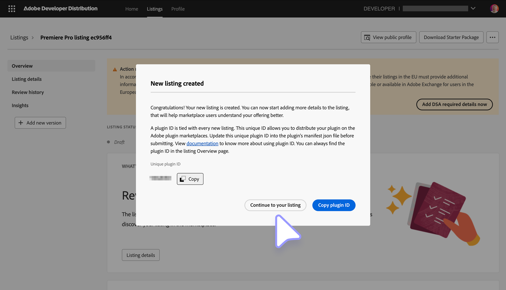
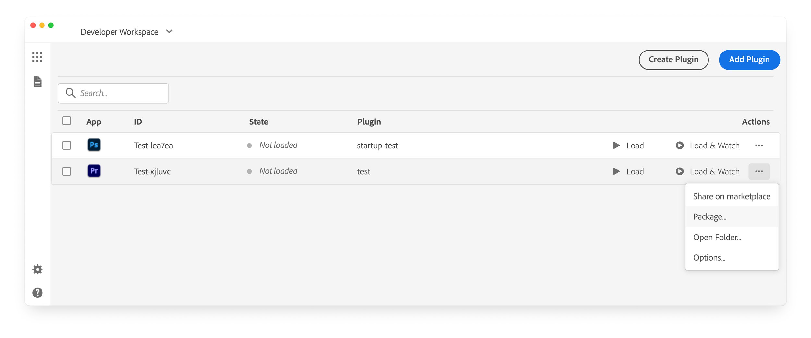
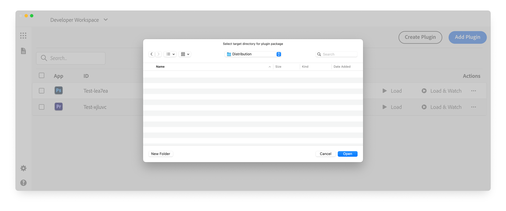
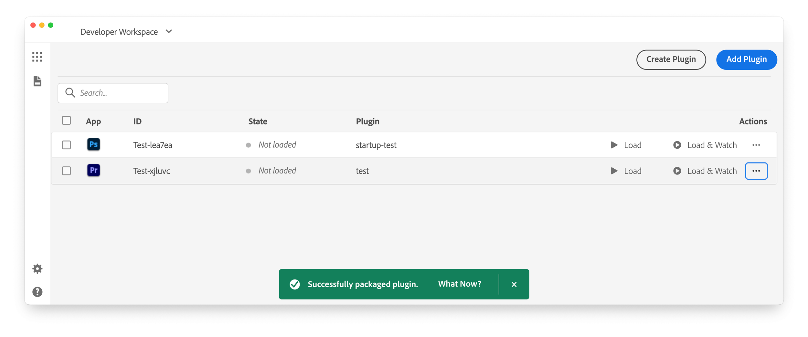
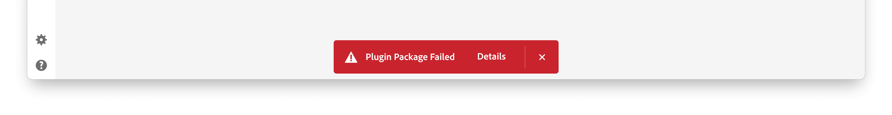

# Package a UXP plugin

Package a finished UXP plugin as a `.ccx` installer for Marketplace, independent, or enterprise distribution. Verify the plugin ID and host configuration before creating the package.

## Understand the `.ccx` format

A `.ccx` file is a ZIP-based plugin installer. Use the UXP Developer Tool (UDT) to create it rather than assembling the archive manually.

### Differences from CEP

CEP extensions used `.zxp` packages. UXP uses `.ccx`, which does not require a package-level digital signature or timestamp.

Creative Cloud Desktop installs `.ccx` files directly; the CEP `ExManCmd` workflow and `MXI` packaging files do not apply to UXP plugins.

## Mind your Plugin's ID

The `id` in `manifest.json` uniquely identifies the installed plugin. Set it before packaging and keep it stable across updates for the same distribution channel.

For **Creative Cloud Marketplace**, create the listing in the [Developer Distribution portal](https://developer.adobe.com/developer-distribution/creative-cloud/docs/guides/plugin-id#starting-from-adobe-developer-distribution), then copy its generated ID into the manifest. A mismatch prevents package validation.

<InlineAlert slots="text, text2" variant="info"/>

See [Create a Listing](../listing/index.md#2-create-a-new-listing) for the portal workflow.

[](../listing/index.md#2-create-a-new-listing)

### Multi-channel distribution

If one plugin is available through Marketplace and another channel, package it with two IDs:

- Use the Developer Distribution portal ID for the Marketplace package.
- Use a separate stable ID for independent or enterprise packages.

Creative Cloud Desktop checks Marketplace entitlements when an installed package uses a Marketplace ID. Reusing that ID for an externally purchased package can cause installation to fail because the Adobe account has no matching Marketplace entitlement.

## Package with the UXP Developer Tool

The plugin must appear in the UDT workspace, but it does not need to be loaded in the host application.

1. Open the plugin's **Actions** (`•••`) menu and select **Package**.



2. Choose the destination folder for the package.



3. Confirm that UDT created a package named from the plugin ID, such as `Test-xjluvc_premierepro.ccx`.



UDT displays a green notification after success. If packaging fails, select **Details** in the red notification and inspect the logs.



Before distributing your package, test the installation to confirm it works as expected.

### Packaging Hybrid Plugins

[Hybrid plugins](../../hybrid-plugins/index.md) contain native C++ libraries (`.uxpaddon` files) in addition to the standard JavaScript, HTML, and CSS files. When packaging a Hybrid plugin, ensure the following:

1. **Directory structure**: place the `.uxpaddon` binaries in the correct platform/architecture folder layout within your plugin bundle:

```txt
my-hybrid-plugin/
|-- manifest.json
|-- index.html
|-- index.js
|-- mac/
|   |-- arm64/
|   |   `-- sample-uxp-addon.uxpaddon
|   `-- x64/
|       `-- sample-uxp-addon.uxpaddon
`-- win/
  `-- x64/
    `-- sample-uxp-addon.uxpaddon
```

2. **All architectures**: include binaries for macOS arm64 (Apple Silicon), macOS x64 (Intel), and Windows x64. While you can package and install a Hybrid plugin with only a subset of architectures (the plugin will simply fail to load on unsupported platforms), the **Creative Cloud Marketplace requires all three**: the Developer Distribution portal will reject your `.ccx` if any architecture is missing.
3. **Code signing (macOS)**: sign and notarize the `.uxpaddon` executables with a valid Apple Developer ID certificate. Self-signed or test certificates are not accepted. The certificate must be valid for at least one year.
4. **Admin credentials**: since Hybrid plugins include native code, users will be prompted for OS administrator credentials during installation and updates.

If the directory structure is incorrect, the plugin will fail to load with a _"Plugin Manifest Validation Failed"_ error in UDT.

## Host Applications

UXP plugin `.ccx` installers can target only one host application at a time; in fact, the [`host`](../../../explanation/concepts/manifest/index.md#host) property in the `manifest.json` file must be a single object of type [`HostDefinition`](../../../explanation/concepts/manifest/index.md#hostdefinition).

**Only during development**, for convenience, you can assign to the `host` property an array of `HostDefinition` objects, allowing the plugin to be loaded in multiple applications simultaneously.

<CodeBlock slots="heading, code" repeat="2" languages="JSON, JSON" />

### Single host for distribution

```json
{
  "host": {
    "app": "premierepro",
    "minVersion": "25.6.0"
  }
}
```

### Multiple hosts during development

```json
{
  "host": [
    { "app": "premierepro", "minVersion": "25.6.0" },
    { "app": "ps", "minVersion": "25.0.0" }
  ]
}
```

<InlineAlert slots="text" variant="info"/>

If an array is present, the **UXP Developer Tool will automatically package the plugin for the first host application**, by converting the array into a single `HostDefinition` object under the hood.
