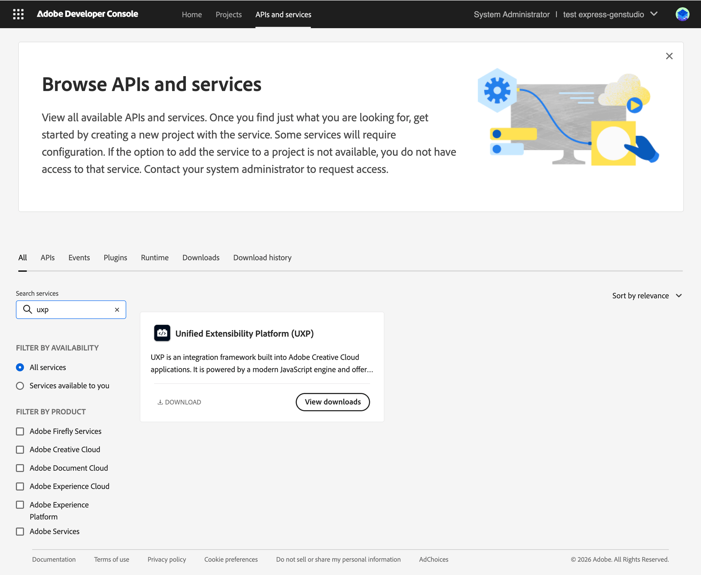

<Superhero slots="heading, text" variant="centered" textColor="white" background="linear-gradient(135deg, #30186E 0%, #6432C8 100%)"/>

# Hybrid plugins

Extend UXP plugins with native C++ for performance-critical processing and platform integrations. Learn when to use a Hybrid plugin, how the JavaScript-to-C++ bridge works, and what it takes to build and ship one.

<Edition slots="text" backgroundcolor="blue" />

Premiere & Photoshop only

<InlineAlert variant="info" slots="heading, text" />

Host support

Hybrid plugins require **Premiere 26.2 or later** or **Photoshop 24.2.0 or later**. Media Encoder and InDesign do not currently support them. Build and test native binaries for every target host, platform, and architecture.

## In this section

<DiscoverBlock slots="link, text" width="300px"/>

[Build a Hybrid Plugin](build.md)

Compile a C++ uxpaddon, connect it to JavaScript, configure the manifest, debug both layers, and package the plugin.

<DiscoverBlock slots="link, text" width="300px"/>

[Hybrid Plugins FAQ](faq.md)

Answers on code signing, architectures, compatibility, and common loading errors.

## How Hybrid plugins work

A Hybrid plugin is a standard UXP plugin that loads a dynamically linked C++ library. JavaScript imports the compiled `.uxpaddon` with `require()` and calls its exported functions like any other module.

The model is similar to [C++ addons](https://nodejs.org/api/addons.html) in Node.js:

```js
const addon = require("sample.uxpaddon");
```

The addon exposes native functions and properties to JavaScript. Keep interface code and routine orchestration in JavaScript, and move only the work that benefits from native execution into C++.

## Choose Hybrid for native work

Hybrid plugins are a good fit for:

- **Performance-intensive media processing:** waveform analysis, frame-level pixel operations, audio DSP, or similar computation.
- **Existing C++ libraries:** image processing, machine learning, codecs, or internal native libraries.
- **High-volume metadata work:** batch XMP processing or custom schema transformations.
- **Native integrations:** hardware SDKs, proprietary pipelines, or platform APIs exposed only through C or C++.

Do not add a native layer when the task can be implemented reliably with UXP or host APIs. Native binaries add platform builds, code signing, testing, and distribution requirements.

## Before you begin

<InlineAlert variant="info" slots="heading, text" />

Advanced C++ topic

Before adding native code, be comfortable [building standard UXP plugins](../../tutorials/build-your-first-plugin/index.md), using the [UXP Developer Tool](../developer-tools/index.md#uxp-developer-tool-udt), and developing C++ dynamic libraries with Xcode or Visual Studio.

| Component                    | Premiere | Photoshop |
| :------------------------------ | :--------- | :----------- |
| **Host application**         | 26.2+    | 24.2.0+   |
| **UXP Developer Tool (UDT)** | 2.2+     | 1.7.0+    |
| **Creative Cloud Desktop**   | 5.10+    | 5.10+     |

## Get the Hybrid Plugin SDK

### Download the SDK

Download the UXP Hybrid Plugin SDK from the [Adobe Developer Console](https://developer.adobe.com/console) (if you get "Access Denied", see [this FAQ](https://developer.adobe.com/developer-distribution/creative-cloud/docs/guides/faq/#what-do-i-do-when-i-get-access-denied-upon-login)). Unpack the contents and read the included `README.md` for platform-specific build instructions.



### Review the SDK contents

The SDK provides headers, utilities, and templates for building native addons, called **uxpaddons**. Its API follows concepts similar to [Node-API](https://nodejs.org/api/n-api.html).

| Folder                     | Contents                                                                                                                                                                      |
| :---------------------------- | :--------------------------------------------------------------------------------------------------------------------------------------------------------------------------- |
| `src/api`                  | **UxpAddonTypes.h**: fundamental data types (opaque abstractions consumed by the SDK APIs). **UxpAddonShared.h**: the full addon API surface, closely mirroring Node-API.   |
| `src/utilities`            | Utility classes with common helpers. **UxpAddon.h** provides the `UXP_ADDON_INIT` and `UXP_ADDON_TERMINATE` macros for registering initialization and termination routines. |
| `template/template-dev`    | Source code for a minimal addon example. Use it as a starting point for your own plugin.                                                                                       |
| `template/template-plugin` | A pre-compiled Hybrid plugin ready to load in UDT.                                                                                                                            |

### Plan SDK updates

The SDK is versioned separately from host applications and labeled by UXP version. Check each target host's release notes for SDK announcements. Adopting a newer SDK requires rebuilding and republishing the native binaries; addons built with an older supported SDK remain compatible with newer supported host releases.

## Next step

Follow [Build a Hybrid Plugin](build.md) to compile an addon, connect it to JavaScript, configure the manifest, debug both layers, and package the plugin.
