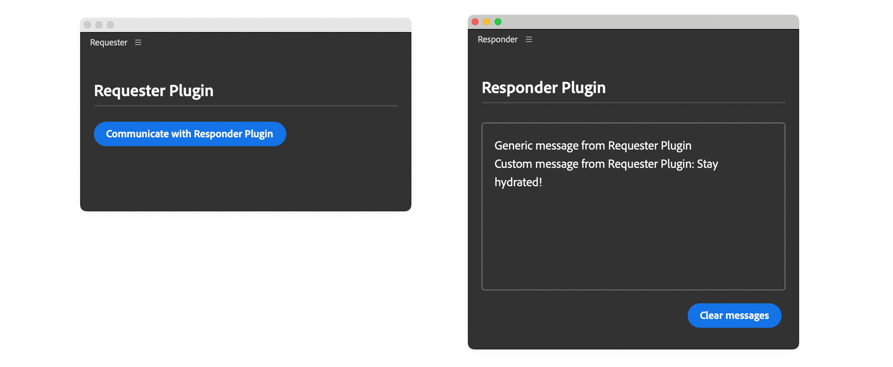

# Communicate between plugins

Use inter-plugin communication (IPC) when one UXP plugin needs to reuse functionality exposed by another plugin in the same host application. Through the UXP Plugin Manager, one plugin can open another plugin's panel or invoke one of its commands.

This guide refers to the plugin that sends the request as the **Requester** and the plugin that receives it as the **Responder**.

## How inter-plugin communication works

Communication depends on both plugins:

- The Responder exposes a command or panel entrypoint and implements its behavior.
- The Requester enables IPC, finds the Responder by its plugin ID, and calls an entrypoint by its ID.



## Before you begin

Make sure you have:

- Two plugins installed in the same host application.
- The Responder's plugin ID and the IDs of the command or panel entrypoints you want to use.
- Any input expected by the Responder's command handler.

<InlineAlert variant="info" slots="text" />

Inter-plugin communication works only within the same host application. A plugin in one application cannot communicate with a plugin in another application, such as from Premiere to Photoshop.

## 1. Expose the Responder entrypoints

The Responder does not need an additional IPC permission. Declare each command or panel that the Requester can use in the Responder's `manifest.json` file:

```json
{
  "entrypoints": [
    {
      "id": "simplePanel",
      "type": "panel",
      "label": { "default": "Main Panel" }
    },
    {
      "id": "simpleCommand",
      "type": "command",
      "label": { "default": "Simple Command" }
    },
    {
      "id": "commandWithInput",
      "type": "command",
      "label": { "default": "Command With Input" }
    }
  ]
}
```

Implement the corresponding command handlers and panel in the Responder's JavaScript. See [Add Commands](../add-commands/index.md) for details about registering command entrypoints.

## 2. Enable communication in the Requester

The Requester must set the [`enablePluginCommunication`](../../explanation/concepts/manifest/index.md#ipcpermission) permission to `true` in its `manifest.json` file:

```json
{
  "requiredPermissions": {
    "ipc": { "enablePluginCommunication": true }
  }
}
```

## 3. Find the Responder

Import `pluginManager`, then search the installed plugins for the Responder's known plugin ID:

```javascript
const { pluginManager } = require("uxp");

const allPlugins = pluginManager.plugins;
const responderPlugin = Array.from(allPlugins)
  .find((plugin) => plugin.id === "Test-responder");
```

Before sending a request, confirm that `responderPlugin` exists and that `responderPlugin.enabled` is `true`.

## 4. Open a panel or invoke a command

Call `showPanel()` with a panel entrypoint ID, or call `invokeCommand()` with a command entrypoint ID:

```javascript
responderPlugin.showPanel("simplePanel");
responderPlugin.invokeCommand("simpleCommand");
```

To pass data to a command, provide it as the second argument to `invokeCommand()`:

```javascript
const payload = { message: "From Requester" };
responderPlugin.invokeCommand("simpleCommand", payload);
```

## Complete example

In this example, a button in the Requester sends three requests to the Responder:

- Open the Responder's panel.
- Invoke the Responder's `simpleCommand` entrypoint.
- Invoke the Responder's `commandWithInput` entrypoint with a payload.

The Responder logs each request in its panel.

### Requester code

<CodeBlock slots="heading, code" repeat="4" languages="HTML, CSS, JavaScript, JSON" />

#### index.html

```html
<!DOCTYPE html>
<html>
<head>
  <script src="main.js"></script>
  <link rel="stylesheet" href="style.css" />
</head>
<body>
  <sp-heading>Requester Plugin</sp-heading>
  <sp-divider></sp-divider>
  <div class="main-div">
    <sp-body id="plugin-body">
      <sp-button id="btnCommunicate">
        Communicate with Responder Plugin
      </sp-button>
    </sp-body>
  </div>
</body>
</html>
```

#### style.css

```css
body { padding: 16px; color: white; }

sp-divider { margin-bottom: 20px; }

sp-heading { color: var(--uxp-host-text-color-secondary, white); }

```

#### main.js

```js
const { pluginManager } = require("uxp");

document
  .querySelector("#btnCommunicate")
  .addEventListener("click", communicateWithAnotherPlugin);

function communicateWithAnotherPlugin() {
  try {
    const allPlugins = pluginManager.plugins;
    const plugin = Array.from(allPlugins).find(
      (plugin) => plugin.id === "Test-responder"
    );
    if (plugin && plugin.enabled) {
      console.log("All commands:", plugin.manifest.commands);
      console.log("All panels:", plugin.manifest.panels);

      // Show the plugin panel. pluginManager cannot hide panels.
      plugin.showPanel("simplePanel");

      // Invoke the command
      plugin.invokeCommand("simpleCommand");

      // Send a payload to the command
      const payload = { message: "Stay hydrated!" };
      plugin.invokeCommand("commandWithInput", payload.message);
    } else {
      // Prompt the user to install/enable the plugin before trying again
    }
  } catch (error) {
    console.error(error);
  }
}

```

#### manifest.json

```json
{
  "id": "Test-requester",
  "name": "Requester",
  "shortname": "3pstarterplugin",
  "version": "1.0.0",
  "main": "index.html",
  "host": { "app": "premierepro", "minVersion": "25.6.0" },
  "manifestVersion": 5,
  "requiredPermissions": {
    "ipc": { "enablePluginCommunication": true }
  },
  "entrypoints": [
    {
      "id": "starterpanel",
      "type": "panel",
      "minimumSize": { "width": 430, "height": 500 },
      "maximumSize": { "width": 2000, "height": 2000 },
      "preferredDockedSize": { "width": 230, "height": 300 },
      "preferredFloatingSize": { "width": 400, "height": 300 },
      "label": { "default": "PremierePro IPC Panel" },
      "icons": [
        {
          "width": 23, "height": 23,
          "path": "icons/dark.png", "scale": [1,2],
          "theme": [ "darkest", "dark", "medium" ]
        },
        {
          "width": 23, "height": 23,
          "path": "icons/light.png", "scale": [1,2],
          "theme": [ "lightest", "light" ]
        }
      ]
    }
  ],
  "icons": [
    {
      "width": 48, "height": 48, "path": "icons/plugin-icon.png",
      "scale": [1,2],
      "theme": [ "darkest", "dark", "medium", "lightest", "light", "all" ],
      "species": [ "pluginList" ]
    }
  ]
}
```

### Responder code

<CodeBlock slots="heading, code" repeat="4" languages="HTML, CSS, JavaScript, JSON" />

#### index.html

```html
<!DOCTYPE html>
<html>
<head>
  <script src="main.js"></script>
  <link rel="stylesheet" href="style.css" />
</head>
<body>
  <sp-heading>Responder Plugin</sp-heading>
  <sp-divider></sp-divider>
  <div class="main-div">
    <sp-body id="plugin-body"> </sp-body>
  </div>
  <footer>
    <sp-button id="clear-btn">Clear messages</sp-button>
  </footer>
</body>
</html>
```

#### style.css

```css
body { color: white; padding: 16px; }

sp-divider { margin-bottom: 20px; }

li:before { content: "• "; width: 3em; }

#plugin-body {
  color: var(--uxp-host-text-color-secondary, white);
  height: 220px; margin-top: 5px; border: 1px solid #808080;
  border-radius: 4px; padding: 16px; overflow: scroll;
}

sp-heading { color: var(--uxp-host-text-color-secondary, white); }

footer {
  display: flex; flex-wrap: wrap; justify-content: flex-end; }

footer > * { margin: 5px; }

footer div { margin-bottom: 1em; width: 100%; }

.main-div { position: relative; }

.clear-btn {
  display: none; position: absolute; top: 10px; right: 6px; cursor: pointer;
}

.main-div:hover .clear-btn { display: inline; }
```

#### main.js

```js
const { entrypoints } = require("uxp");

entrypoints.setup({
  commands: {
    simpleCommand: () => doThing(),
    commandWithInput: (args) => doThing(args),
  },
  panels: {
    simplePanel: { show(rootNode) {} },
  },
});

// Log messages to the panel's body
function logToPanel(msg) {
  const bodyElement = document.getElementById("plugin-body");
  const message =
    msg === undefined
      ? `Generic message from Requester Plugin <br />`
      : `<span>Custom message from Requester Plugin: ${msg}</span><br />`;
  bodyElement.innerHTML += message;
}

// Handle both command entrypoints
function doThing(args) {
  console.log("payload", args);
  // Pass a payload (if any) to the panel
  logToPanel(args && args.data[0]);
}

// Clear the panel's body
document.getElementById("clear-btn").addEventListener("click", () => {
  const bodyElement = document.getElementById("plugin-body");
  if (bodyElement) {
    bodyElement.innerHTML = "";
  }
});

```

#### manifest.json

```json
{
  "id": "Test-responder",
  "name": "Responder",
  "shortname": "3pstarterplugin",
  "version": "1.0.0",
  "main": "index.html",
  "host": { "app": "premierepro", "minVersion": "25.6.0" },
  "manifestVersion": 5,
  "entrypoints": [
    {
      "id": "simplePanel",
      "type": "panel",
      "minimumSize": { "width": 430, "height": 500 },
      "maximumSize": { "width": 2000, "height": 2000 },
      "preferredDockedSize": { "width": 230, "height": 300 },
      "preferredFloatingSize": { "width": 400, "height": 300 },
      "label": { "default": "Main Panel" },
      "icons": [
        {
          "width": 23, "height": 23,
          "path": "icons/dark.png", "scale": [1,2],
          "theme": [ "darkest", "dark", "medium" ]
        },
        {
          "width": 23, "height": 23,
          "path": "icons/light.png", "scale": [1,2],
          "theme": [ "lightest", "light" ]
        }
      ]
    },
    {
      "id": "simpleCommand",
      "type": "command",
      "label": {
        "default": "Simple Command"
      }
    },
    {
      "id": "commandWithInput",
      "type": "command",
      "label": {
        "default": "Command With Input"
      }
    }
  ],
  "icons": [
    {
      "width": 48, "height": 48, "path": "icons/plugin-icon.png",
      "scale": [1,2],
      "theme": [ "darkest", "dark", "medium", "lightest", "light", "all" ],
      "species": [ "pluginList" ]
    }
  ]
}
```

## Limitations and troubleshooting

- UXP may not report an error when an entrypoint ID does not exist. Check `plugin.manifest.commands` and `plugin.manifest.panels` to verify the available IDs.
- A user can disable the Responder through the Creative Cloud desktop app. Check `plugin.enabled` before sending a request.
- Payload objects cannot contain methods.
- `showPanel()` can show a panel, but it cannot hide one.
