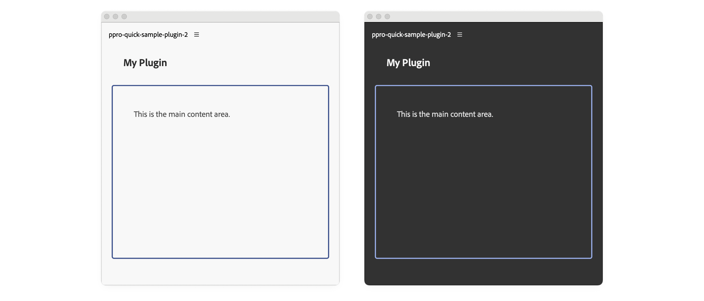

# Style a UXP interface

Use stylesheets for reusable presentation, inline declarations for isolated values, and JavaScript when a style depends on runtime state. UXP follows familiar web patterns but supports a defined subset of browser CSS.

<Fragment src="../_shared/prerequisites.md" />

## Choose a styling method

The following example compares CSS classes, inline styles, and JavaScript-assigned styles. Prefer classes for most interface styling because they keep presentation separate and are easier to update for host themes.

<CodeBlock slots="heading, code" repeat="3" languages="HTML, JavaScript, CSS" />

#### index.html

```html
<!-- 1. Using CSS classes -->
<div class="green-background">
  <h1>Styled with CSS class</h1>
</div>

<!-- 2. Using inline styles -->
<div style="background-color: yellow;">
  <h1>Styled inline</h1>
</div>

<!-- 3. Using JavaScript -->
<div id="exampleDiv">
  <h1>Styled with JavaScript</h1>
</div>
```

#### index.js

```js
// Apply styles via JavaScript
const exampleDiv = document.getElementById("exampleDiv");
exampleDiv.style.backgroundColor = "orange";
```

#### styles.css

```css
/* Define styles in a stylesheet */
.green-background {
  background-color: green;
}
```

## Respond to the host theme

In Premiere, `document.theme.getCurrent()` returns the active `"light"`, `"dark"`, or `"darkest"` theme. The `document.theme.onUpdated` event runs when the user changes it.

Apply the current theme when the plugin loads, then update the interface from the event listener.

### Update individual styles

<CodeBlock slots="heading, code" repeat="2" languages="HTML, JavaScript" />

#### index.html

```html
<body>
  <h4 id="plugin-heading">Application Info</h4>
  <div class="main-div">
    <div id="plugin-body"> </div>
  </div>
  <footer>
    <button id="btnPopulate">Populate Application Info</button>
    <button id="clear-btn">Clear Application Info</button>
  </footer>
</body>
```

#### index.js

```javascript
function updateTheme(theme) {
  const panelBody = document.getElementById("plugin-body");
  const panelHeading = document.getElementById("plugin-heading");

  if (theme.includes("dark")) {
    panelBody.style.color = "#fff";
    panelHeading.style.color = "#fff";
  } else {
    panelBody.style.color = "#000";
    panelHeading.style.color = "#000";
  }
}

// Listen for theme changes
document.theme.onUpdated.addListener((theme) => {
  updateTheme(theme);
});

// Apply initial theme on load
const currentTheme = document.theme.getCurrent();
updateTheme(currentTheme);
```

### Switch theme classes

For interfaces with many themed values, apply one class to `body` and define colors as CSS custom properties. Changing the class updates every declaration that uses those properties.

The example defines `--heading-color`, `--body-color`, and `--border-color` for light and dark themes, then references them throughout the stylesheet.

<CodeBlock slots="heading, code" repeat="3" languages="HTML, JavaScript, CSS" />

#### index.html

```html
<body>
  <sp-heading>My Plugin</sp-heading>
  <div class="plugin-body">
    <sp-body>This is the main content area.</sp-body>
  </div>
</body>
```

#### index.js

```javascript
function updateTheme(theme) {
  document.body.classList.remove("theme-light", "theme-dark");
  document.body.classList.add(
    theme.includes("dark") ? "theme-dark" : "theme-light"
  );
}

// Listen for theme changes
document.theme.onUpdated.addListener((theme) => {
  updateTheme(theme);
});

// Apply initial theme on load
const currentTheme = document.theme.getCurrent();
updateTheme(currentTheme);

```

#### styles.css

```css
/* Theme CSS Variables */
body.theme-light {
  --heading-color: #2c2c2c;
  --body-color: #4a4a4a;
  --border-color: #40548e;
}

body.theme-dark {
  --heading-color: #f5f5f5;
  --body-color: #e0e0e0;
  --border-color: #97ace6;
}

body {
  padding: 0 16px;
}

.plugin-body {
  margin-top: 5px;
  padding: 16px;
  overflow: scroll;
  height: 300px;
  border-radius: 4px;
  border: 2px solid var(--border-color);
}

sp-heading {
  padding: 16px 20px;
  margin: 0 0 12px 0;
  font-size: 18px;
  color: var(--heading-color);
}

sp-body {
  padding: 20px;
  margin: 0;
  line-height: 1.6;
  font-size: 14px;
  color: var(--body-color);
}
```



### Check host-provided CSS variables

Some Creative Cloud hosts provide built-in variables such as `--uxp-host-text-color`. These variables are not currently supported in Premiere, so use explicit theme classes there and check the target host's documentation before relying on host variables.

## Account for UXP constraints

<InlineAlert variant="warning" slots="heading, text"/>

UXP is not a browser

UXP does not support all CSS properties. For example, CSS Grid Layout is not available.

### Compile preprocessors

UXP only understands standard CSS. If you want to use preprocessors like **Sass** or **SCSS**, you must transpile them to CSS before bundling your plugin. This requires build tools like Webpack and a slightly different [debugging workflow](../../udt-deep-dive/plugin-workflows.md#working-with-bundlers).

### Prefer Spectrum components

Use [Spectrum](../../../explanation/fundamentals/user-interfaces/index.md#spectrum-web-components-swc) components where they meet the interface requirement. They provide controls designed to align with Adobe application interfaces.
