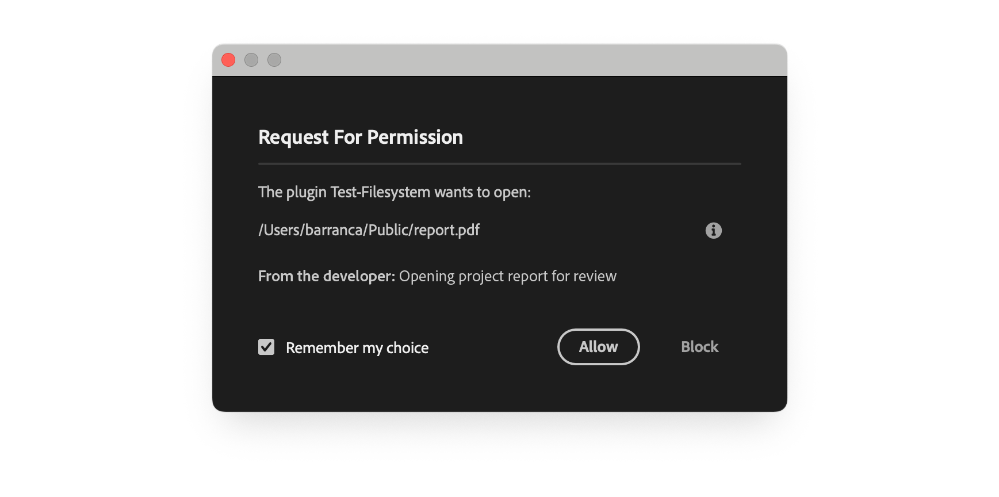
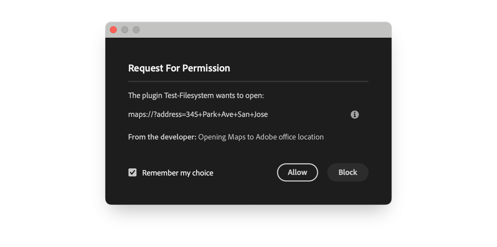

# Launch external processes

Use the UXP `shell` API to open a local file in its default application or launch a registered URL scheme. Declare every file extension and scheme in the manifest, and explain each launch clearly in the consent dialog.

<Fragment src="../_shared/prerequisites.md" />

## Request launch permission

By default, UXP plugins can't launch external processes; this protects users from unwanted or malicious activity. If your plugin needs to open files or launch applications, **you must declare** the [`launchProcess`](../../../explanation/concepts/manifest/index.md#launchprocesspermission) permission in your `manifest.json`. It has two components:

- **Extensions**: file extensions your plugin can open, for example, `[".pdf", ".txt"]`.
- **Schemes**: URL schemes your plugin can use, for example, `["https", "mailto"]`.

```json
{
  "requiredPermissions": {
    "launchProcess": {
      "extensions": [".pdf", ".mp4"],
      "schemes": ["https", "mailto"]
    }
  }
}
```

<InlineAlert variant="warning" slots="heading, text"/>

User consent is always required

Whenever your plugin attempts to launch an external process, **the user must provide explicit consent** through a system dialog. Always provide clear, helpful context in the `developerText` parameter to explain why the action is needed.

## Choose a shell method

The `shell` module provides two main methods:

- **`openPath()`**: Opens a file or folder in the system's default application.
- **`openExternal()`**: Launches an application using a URL scheme.

Both methods require user consent and return a [Promise](https://developer.mozilla.org/en-US/docs/Web/JavaScript/Reference/Global_Objects/Promise) that resolves with an empty string on success or an error message on failure.

**Access the API:**

```javascript
const { shell } = require("uxp");
```

### Open a file or folder

Use `openPath()` to open any file on the user's system in its default application. For example, PDFs in a reader, videos in a player, or text files in an editor.

<CodeBlock slots="heading, code" repeat="2" languages="JavaScript, JSON" />

#### index.js

```js
const { shell } = require("uxp");

async function openPdfFile() {
  try {
    // For macOS
    const result = await shell.openPath(
      "/Users/user/Desktop/report.pdf",
      "Opening project report for review"
    );
    // For Windows, use: "C:\\Users\\user\\Desktop\\report.pdf"

    if (result === "") {
      console.log("File opened successfully");
    } else {
      console.error(`Failed to open file: ${result}`);
    }
  } catch (error) {
    console.error("Error opening file:", error);
  }
}

async function openProjectFolder() {
  // An empty extension in the manifest allows folders.
  try {
    // For macOS
    const result = await shell.openPath(
      "/Users/user/Documents/Projects",
      "Opening project folder"
    );
    // For Windows, use: "C:\\Users\\user\\Documents\\Projects"

    if (result === "") {
      console.log("Folder opened successfully");
    } else {
      console.error(`Failed to open folder: ${result}`);
    }
  } catch (error) {
    console.error("Error opening folder:", error);
  }
}
```

#### manifest.json

```json
{
  "manifestVersion": 5,
  "requiredPermissions": {
    "launchProcess": {
      "extensions": [".pdf", ".txt", ".mp4", ""]
    }
  }
}
```

UXP displays a consent dialog before opening the file or folder. The user may choose to remember the decision.



<InlineAlert variant="info" slots="text, text2"/>

List every file extension passed to `openPath()` in [`launchProcess.extensions`](../../../explanation/concepts/manifest/index.md#extensions). Add an empty string `""` when the plugin needs to open folders.

If you attempt to open a file with an unlisted extension, the operation will fail.

### Open a URL scheme

Use `openExternal()` to launch applications via URL schemes: open websites in browsers, compose emails, or trigger platform-specific apps like Maps.

<CodeBlock slots="heading, code" repeat="2" languages="JavaScript, JSON" />

#### index.js

```js
const { shell } = require("uxp");

async function openDocumentation() {
  try {
    const result = await shell.openExternal(
      "https://developer.adobe.com/",
      "Opening Adobe Developer documentation"
    );

    if (result === "") {
      console.log("Browser opened successfully");
    } else {
      console.error(`Failed to open browser: ${result}`);
    }
  } catch (error) {
    console.error("Error opening browser:", error);
  }
}

async function sendFeedbackEmail() {
  try {
    const subject = encodeURIComponent("Plugin Feedback");
    const body = encodeURIComponent("I have feedback about your plugin...");

    const result = await shell.openExternal(
      `mailto:support@example.com?subject=${subject}&body=${body}`,
      "Opening mail client to send feedback"
    );

    if (result === "") {
      console.log("Mail client opened successfully");
    } else {
      console.error(`Failed to open mail client: ${result}`);
    }
  } catch (error) {
    console.error("Error opening mail client:", error);
  }
}

async function openLocationInMaps() {
  try {
    // For macOS: use maps:// scheme
    const macResult = await shell.openExternal(
      "maps://?address=345+Park+Ave+San+Jose",
      "Opening Maps to Adobe office location"
    );

    // For Windows: use bingmaps: scheme
    // const winResult = await shell.openExternal(
    //   "bingmaps:?q=345+Park+Ave+San+Jose,+95110",
    //   "Opening Maps to Adobe office location"
    // );

    if (macResult === "") {
      console.log("Maps opened successfully");
    } else {
      console.error(`Failed to open Maps: ${macResult}`);
    }
  } catch (error) {
    console.error("Error opening Maps:", error);
  }
}
```

#### manifest.json

```json
{
  "manifestVersion": 5,
  "requiredPermissions": {
    "launchProcess": {
      "schemes": ["https", "mailto", "maps", "bingmaps"]
    }
  }
}
```

Both `openExternal()` and `openPath()` display a user-consent dialog.



<InlineAlert variant="info" slots="text"/>

The `file:/` scheme is **not allowed** with `openExternal()`. Use `openPath()` instead for opening local files.

### Choose a platform-specific scheme

URL schemes vary between operating systems. Some schemes are platform-specific:

| Scheme      | Platform | Purpose             |
| :------------ | :--------- | :--------------------- |
| `https://`  | Both     | Open web browser    |
| `mailto:`   | Both     | Compose email       |
| `maps://`   | macOS    | Open Apple Maps     |
| `bingmaps:` | Windows  | Open Bing Maps      |
| `facetime:` | macOS    | Start FaceTime call |

<InlineAlert variant="warning" slots="text"/>

Always check the user's platform before using platform-specific schemes. Attempting to use `maps://` on Windows or `bingmaps:` on macOS will fail silently or display an error.

### Open an executable file

`shell.openPath()` can open an executable or script file, but it cannot pass command-line arguments or capture process output:

```js
const commandResult = await shell.openPath(
  "/bin/ls",
  "Running the ls command"
);

const argumentResult = await shell.openPath(
  "/bin/ls -la", // Fails because the argument is part of the path.
  "Running the ls -la command"
);
```

## Follow launch best practices

1. **Provide clear context**: The `developerText` parameter appears in the user consent dialog. Write clear, user-friendly explanations in plain language.

```javascript
// Clear and specific
await shell.openExternal(
  "https://example.com/guide",
  "Opening tutorial guide in your browser"
);

// Too vague
await shell.openExternal(
  "https://example.com/guide",
  "Opening URL"
);
```

2. **Handle user denial gracefully**: Users can deny the launch request. Check the return value and provide fallback options.

```javascript
const result = await shell.openPath(
  filePath,
  "Opening project file"
);
if (result !== "") {
  // User denied or operation failed
  console.log("Unable to open file. Please open it manually.");
}
```

3. **Check platform compatibility**: Use platform detection for platform-specific schemes.

```javascript
const isMac = require("os").platform() === "darwin";
const scheme = isMac ? "maps://" : "bingmaps:";
```

4. **Encode URL parameters**: When building URLs with query parameters, always encode special characters.

```javascript
const subject = encodeURIComponent("My Subject");
const url = `mailto:user@example.com?subject=${subject}`;
```

5. **Declare all schemes and extensions**: Only list the schemes and extensions your plugin actually uses. Don't request unnecessary permissions.

## Troubleshoot launch failures

| Symptom                              | Likely Cause           | Solution                                                              |
| :--------------------------------------- | :------------------------- | :--------------------------------------------------------------------- |
| Permission denied error              | Missing manifest entry | Add the extension or scheme to `launchProcess` in manifest            |
| Operation fails silently             | User denied consent    | Check return value and handle denial gracefully                       |
| Platform-specific scheme not working | Wrong scheme for OS    | Use platform detection to choose the correct scheme                   |
| `file://` scheme doesn't work        | Wrong method used      | Use `openPath()` for local files, not `openExternal()`                |
| UWP restrictions on Windows          | System security policy | UWP apps can only access files in their sandbox on Windows Store apps |
