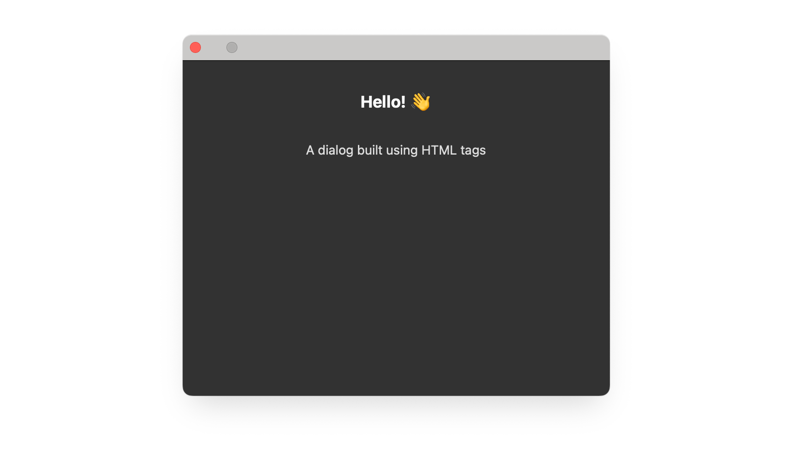
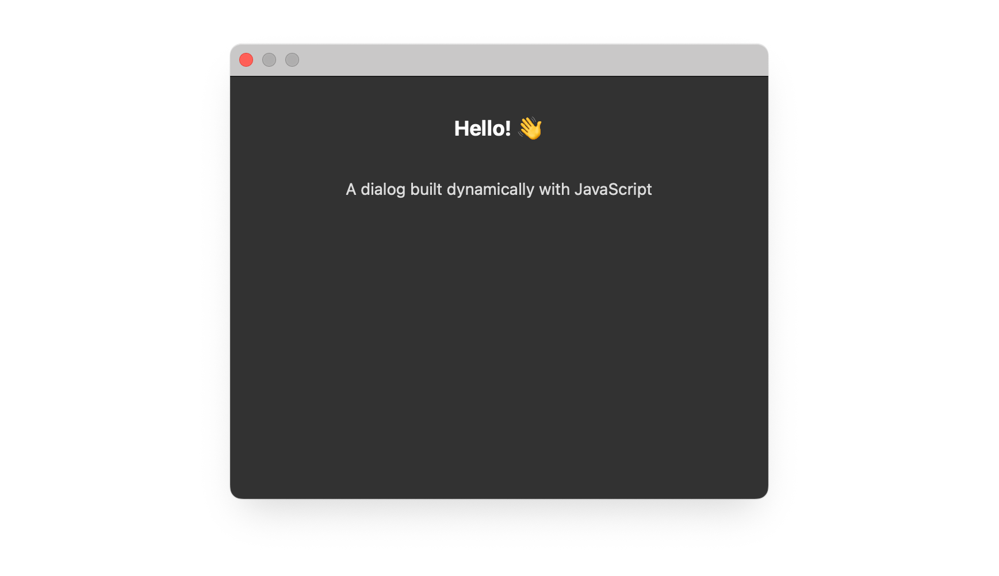

# Create HTML elements

Define stable panel interfaces in HTML. Create elements with JavaScript when the structure depends on runtime data or when a command needs to construct a modal dialog dynamically.

<Fragment src="../_shared/prerequisites.md" />

## Define elements in HTML

Put persistent interface structure in `index.html`, apply presentation in a stylesheet, and use JavaScript only for behavior.

<CodeBlock slots="heading, code" repeat="3" languages="HTML, JavaScript, CSS" />

#### index.html

```html
<button id="showDialog">Show Dialog</button>

<dialog id="sampleDialog">
  <div>
    <h1>Hello!</h1>
    <p>A dialog built using HTML tags</p>
  </div>
</dialog>
```

#### index.js

```js
const showDialogButton = document.getElementById("showDialog");
showDialogButton.addEventListener("click", async () => {
  const dialog = document.getElementById("sampleDialog");
  await dialog.uxpShowModal({
    title: "HTML dialog",
    resize: "none",
    size: { width: 400, height: 300 },
  });
});
```

#### styles.css

```css
#sampleDialog > div {
  display: flex;
  flex-direction: column;
  height: 300px;
  width: 400px;
  align-items: center;
  color: #ddd;
}

h1 { color: #fff; }

#sampleDialog > div > p {
  margin-top: 30px;
}

```



## Create elements with JavaScript

Use `document.createElement()` when the interface is generated at runtime. Append each child to its container, then add the completed dialog to the document before opening it.

<CodeBlock slots="heading, code" repeat="2" languages="HTML, JavaScript" />

#### index.html

```html
<!DOCTYPE html>
<html>
  <head>
    <script src="main.js"></script>
    <link rel="stylesheet" href="style.css" />
  </head>

  <body>
    <button id="showDialog">Show Dialog</button>
  </body>
</html>

```

#### index.js

```js
const showDialogButton = document.getElementById("showDialog");
showDialogButton.addEventListener("click", async () => {
  // Create dialog element
  const dialog = document.createElement("dialog");


  // Create container
  const div = document.createElement("div");
  div.style.display = "flex";
  div.style.flexDirection = "column";
  div.style.height = "300px";
  div.style.width = "400px";
  div.style.alignItems = "center";
  div.style.color = "#ddd";

  // Create header
  const header = document.createElement("h1");
  header.textContent = "Hello!";
  header.style.color = "#fff";
  div.appendChild(header);

  // Create paragraph
  const para = document.createElement("p");
  para.textContent = "A dialog built dynamically with JavaScript";
  para.style.marginTop = "30px";
  div.appendChild(para);

  // Assemble and show
  dialog.appendChild(div);
  document.body.appendChild(dialog);
  await dialog.uxpShowModal({
    title: "JavaScript dialog",
    resize: "none",
    size: { width: 400, height: 300 },
  });
});
```



## Create Spectrum components

You can use `document.createElement()` to create Spectrum UI elements dynamically:

```js
// Create a Spectrum button
const button = document.createElement("sp-button");
button.textContent = "Click me";
button.setAttribute("variant", "cta");
document.body.appendChild(button);
```

<InlineAlert variant="info" slots="text"/>

`document.createElement()` works for Spectrum Widgets (`sp-*` elements). Define Spectrum Web Components in HTML markup instead.
