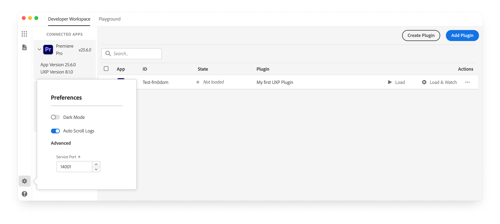
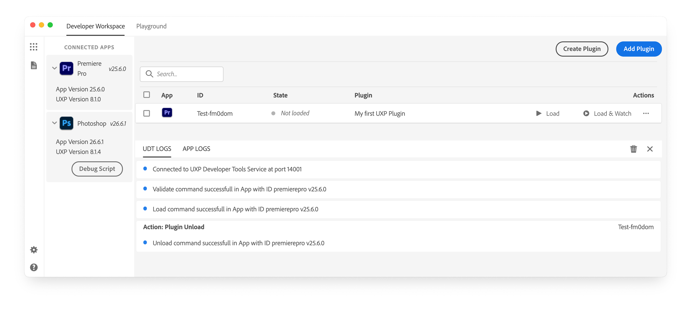

# Use the UXP Developer Tool

The UXP Developer Tool (UDT) is your workspace for loading, testing, and debugging UXP plugins. This guide introduces the controls you use to connect host applications, configure UDT, and inspect logs.

## Before you begin

Before continuing, make sure you have:

- [Installed UDT v2.2 or later](../developer-tools/index.md#uxp-developer-tool-udt).
- [Enabled Developer Mode](../developer-tools/index.md#enable-developer-mode) in UDT and your host application.
- [Scaffolded a plugin](../../tutorials/build-your-first-plugin/index.md#1-scaffold-your-plugin).

## Navigate the workspace

The Developer Workspace displays connected applications in the sidebar and your plugins in the main area. Use the controls along the left edge to switch between the workspace, logs, and preferences.

### Connected applications

The **Connected Apps** panel lists running Creative Cloud desktop applications that support UXP. UDT can load a plugin only while its host application is running. Launch a supported application, and it appears in the panel automatically.

If an application does not appear, confirm that its installed version supports UXP extensibility. If the sidebar is hidden, select the grid icon in the upper-left corner.

### Preferences

Select the gear icon in the lower-left corner to open Preferences. From there, you can choose a light or dark **Theme**, turn **Auto Scroll Logs** on or off, and change the **Service Port** that UDT uses to communicate with host applications.

### Logs

Select the document icon in the upper-left corner to open Logs. Use **UDT Logs** to review connection events and plugin load status. Use **App Logs** to investigate issues reported by the host application.

## Read more

<Cards slots="heading, text, links" repeat="3" width="100%" />

### Plugin management

Create new plugins or add existing ones to your workspace.

[Manage plugins](plugin-management.md)

### Plugin workflows

Load, debug, watch, and unload plugins during development.

[Use plugin workflows](plugin-workflows.md)

### The Playground

Test UXP APIs and code in a sandboxed environment.

[Open the Playground](playground.md)
