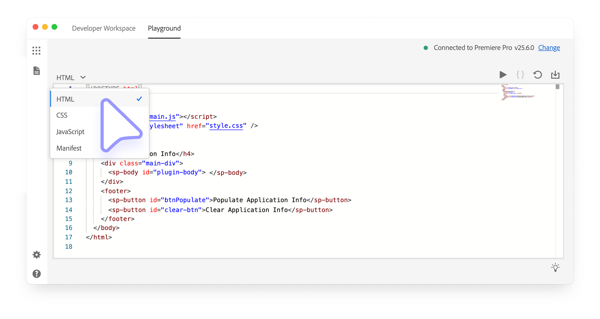
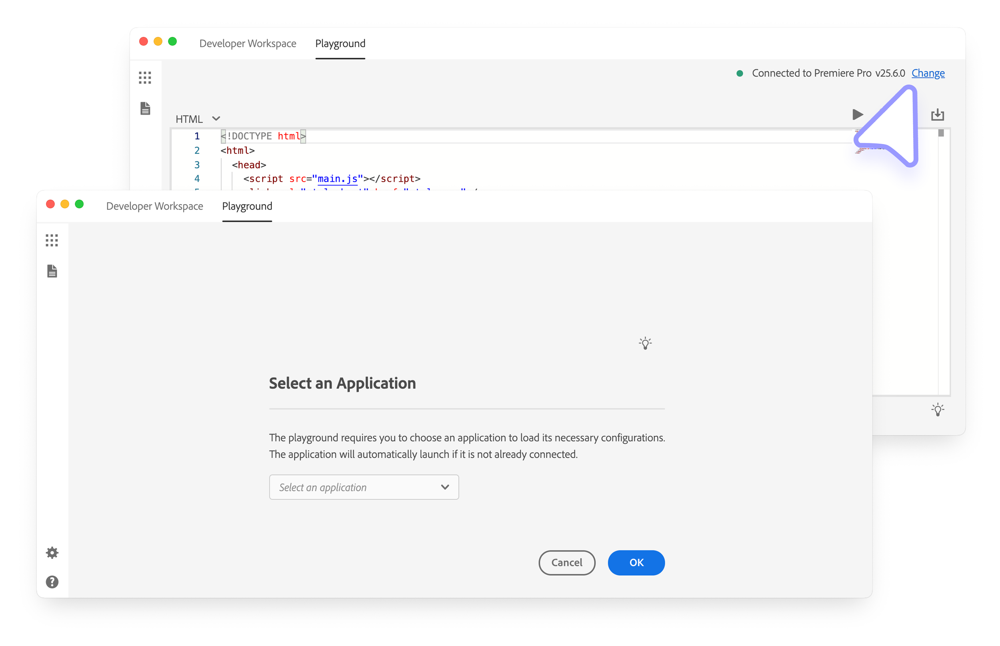
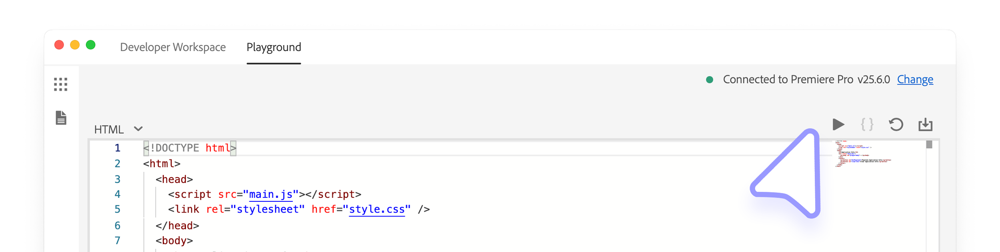
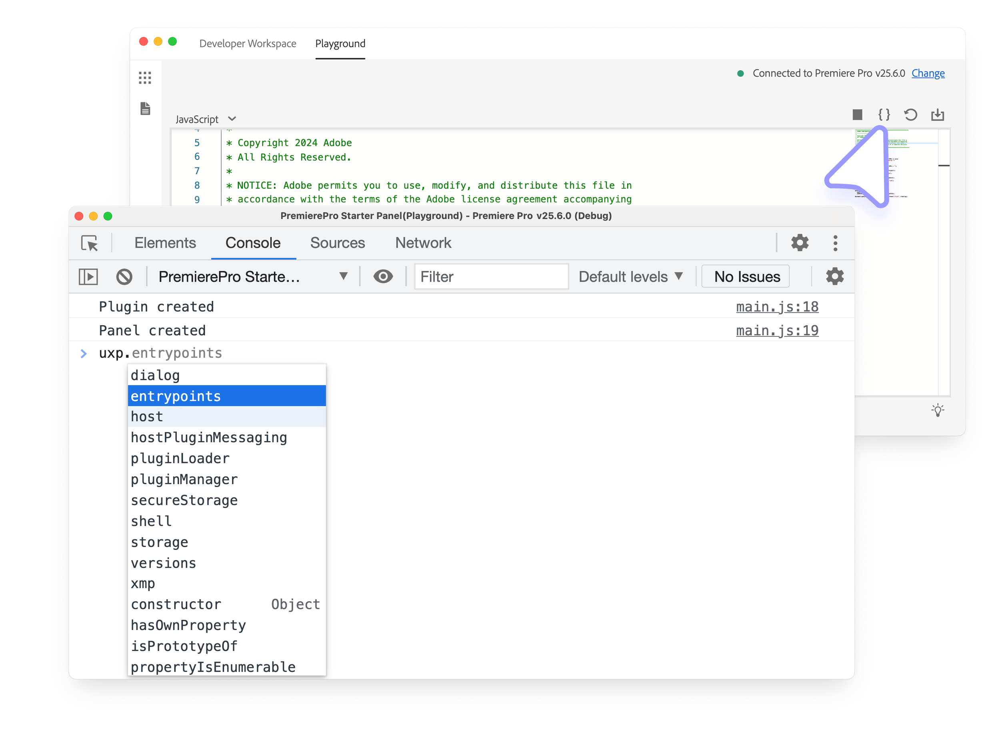
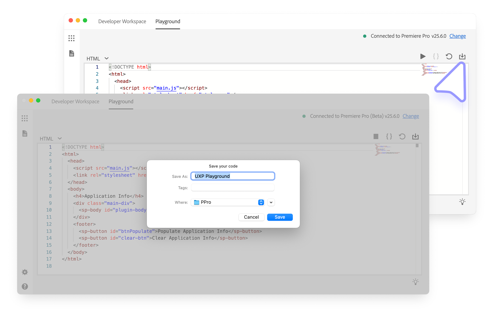

# Use the UDT Playground

The Playground provides a sandbox for testing UXP markup, styles, and JavaScript without creating a project on disk. Use it to explore an API, verify a small interaction, or iterate on an interface before moving the code into a plugin project.

## Before you begin

Launch a supported Creative Cloud application and confirm that it appears under [Connected Apps](index.md#connected-applications) in UDT.

## 1. Open the Playground

Select **Playground** in the top toolbar. Use the language menu to switch among the HTML, CSS, JavaScript, and Manifest editors.

If multiple supported applications are running, select **Change** in the upper-right corner, choose the target host, and confirm with **OK**.

## 2. Load the prototype

Select **Play** in the upper-right corner to load the Playground code into the selected host application.

UDT displays **Plugin Load Successful** after a successful load. If loading fails, select **Details** in the **Plugin Load Failed** notification to inspect the log.

## 3. Edit and debug the prototype

After the initial load, changes in the HTML, CSS, and JavaScript editors automatically refresh the plugin. Select **Reset** to restore the Playground's initial code.

<InlineAlert slots="heading, text" variant="info"/>

Manifest changes

Changes in the Manifest editor do not reload automatically. Select **Unload**, then **Play** to load the updated manifest.

Select the **`{}`** control to open the UDT debugger. It is based on [Chrome DevTools](../../explanation/tech-stack/index.md#debugging) and provides tools for inspecting elements, console output, and JavaScript execution.

## 4. Export the project

Select **Download** in the upper-right corner and choose a destination. UDT exports the current HTML, CSS, JavaScript, and manifest into a **UXP Playground** project folder that you can add to the Developer Workspace as a regular plugin.

