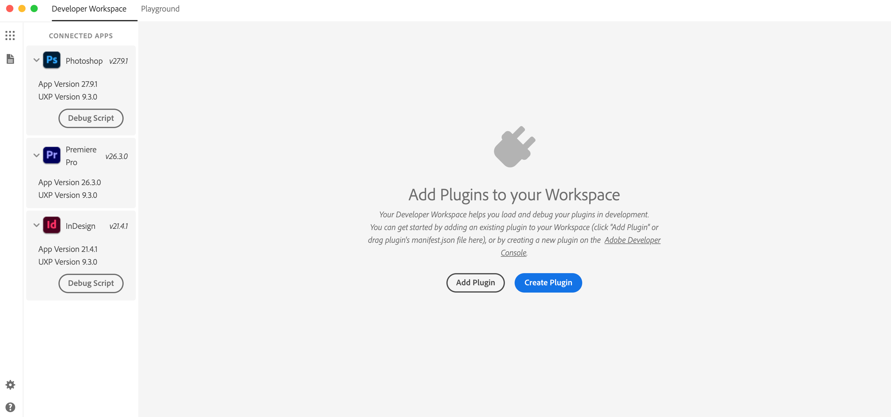
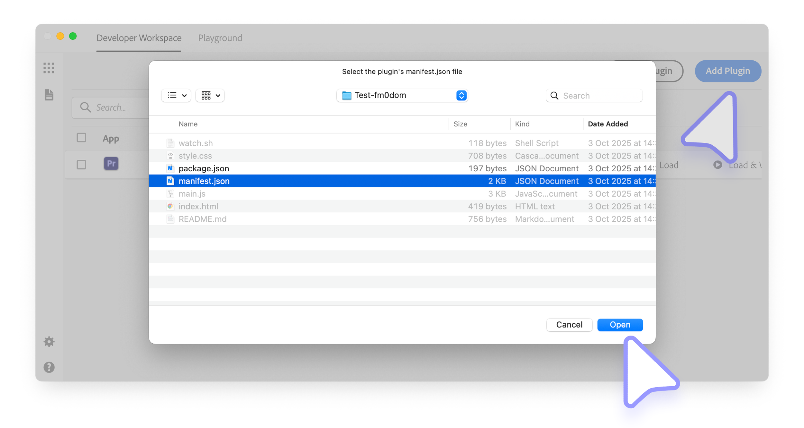
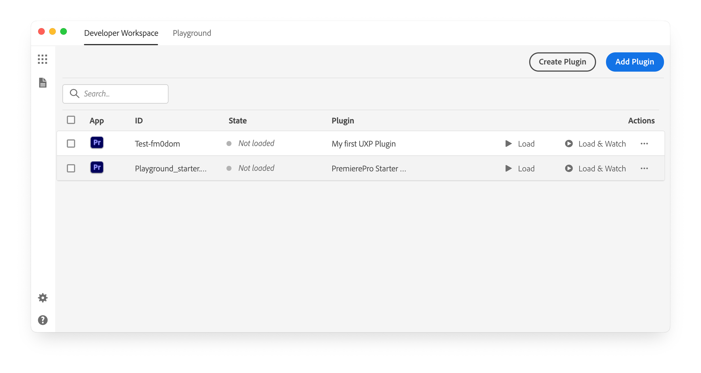
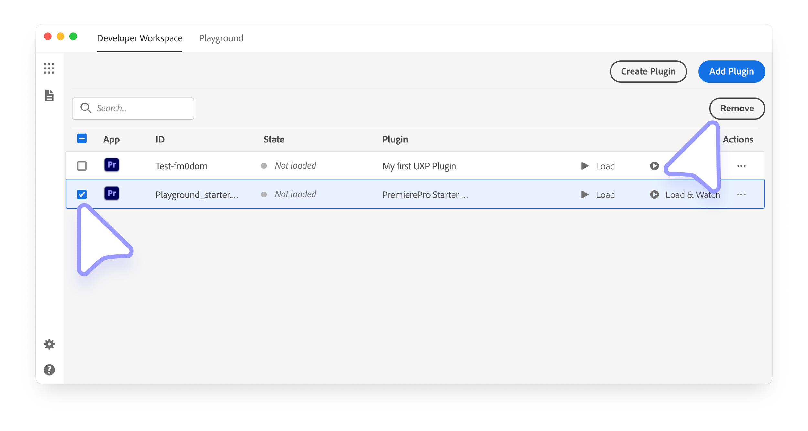

# Manage plugins in UDT

The UXP Developer Tool (UDT) keeps your development projects in one workspace. Create a project from a template or add an existing project from disk, then load it when its host application is running.

## Create a plugin from a template

Select **Create Plugin**, choose a UDT template, and complete the project details. [Build Your First Plugin](../../tutorials/build-your-first-plugin/index.md#1-scaffold-your-plugin) walks through the complete setup.

## Add an existing plugin

To add a project already stored on disk:

1. Select **Add Plugin**.
2. Choose the project's `manifest.json` file.
3. Select **Open** to add the project to the workspace.

Adding a project does not load it into a host application. You can keep it in the workspace until you are ready to work with it.

## Remove a plugin from the workspace

Select the checkbox beside one or more projects, then select **Remove Selected** in the upper-right corner.

<InlineAlert variant="info" slots="text"/>

Removing a plugin from the UDT workspace does not delete its files from disk. You can add the project again later by selecting its manifest.

## Next step

After adding a project, [load, watch, and debug the plugin](plugin-workflows.md).
