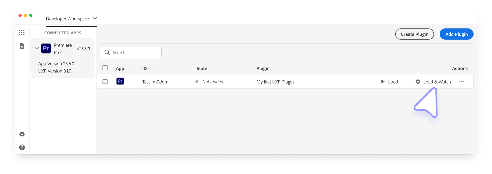
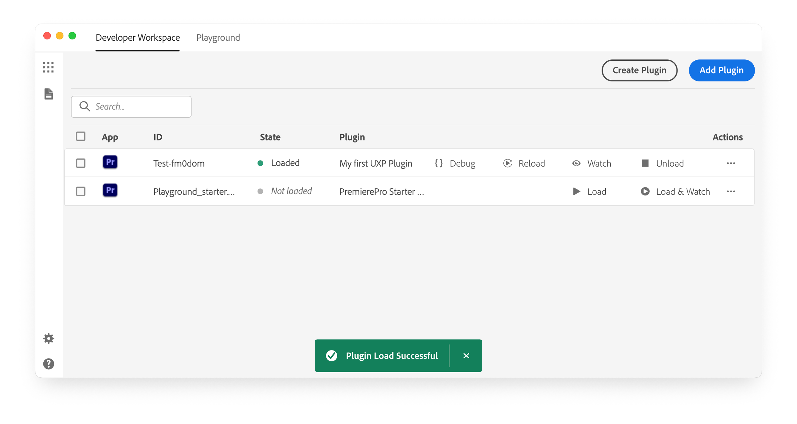
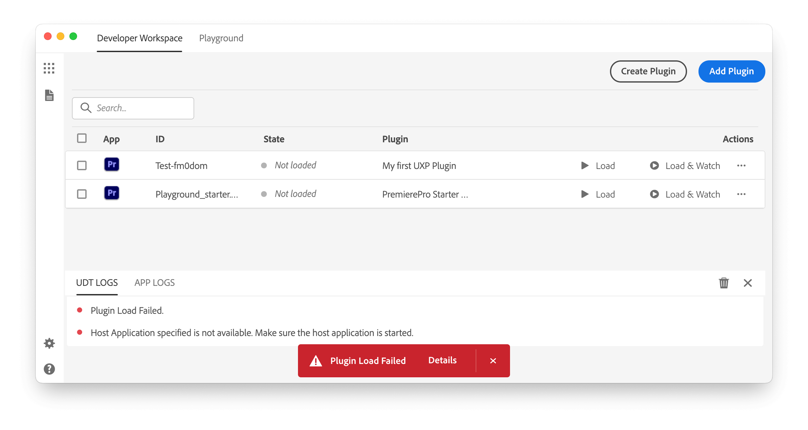
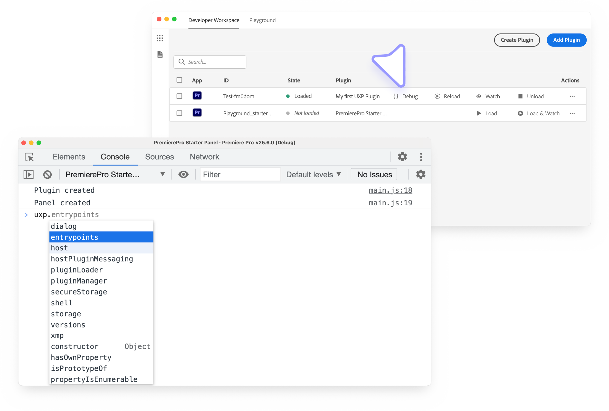
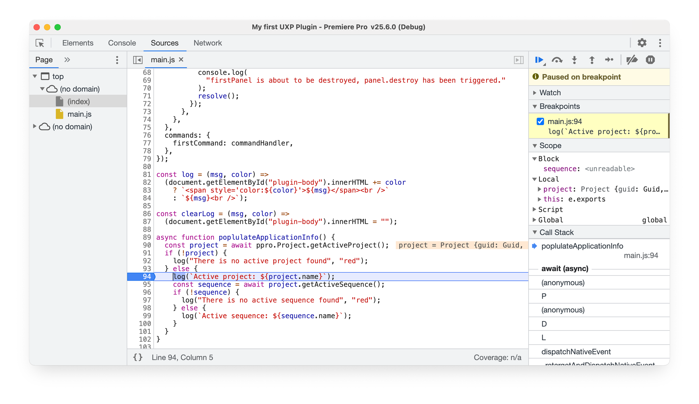
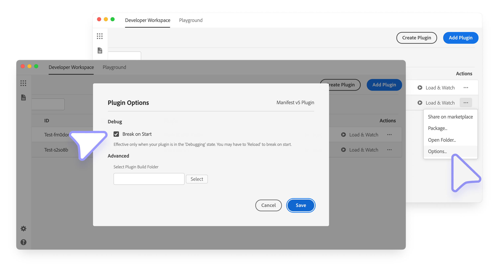
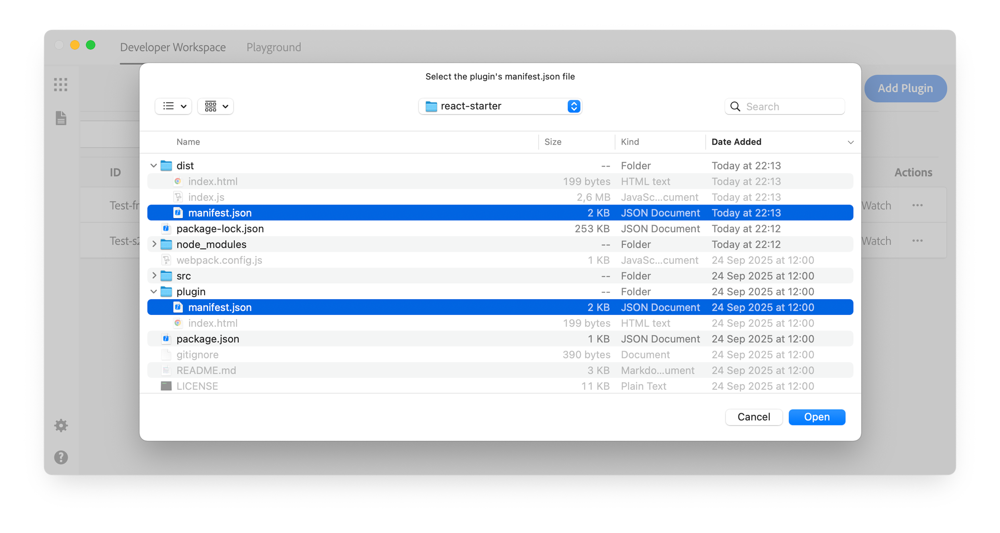
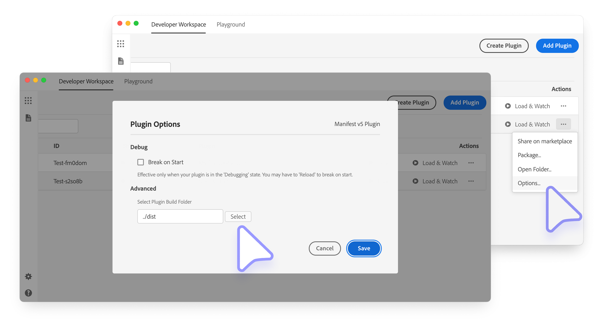

# Run plugin workflows in UDT

After adding a project to the UXP Developer Tool (UDT), load it into a running host application, watch it during development, and open the debugger when something fails.

## Load or watch a plugin

Adding a project to the Developer Workspace does not load it into the host application. Start the supported host, then choose one of these actions in the plugin row:

- **Load:** Load the current plugin files once.
- **Load & Watch:** Load the plugin and reload it when its source files change. Use this option during active development.

After a successful load, UDT displays a green **Plugin Load Successful** notification.

If loading fails, select **Details** in the red **Plugin Load Failed** notification to inspect the UDT logs.

With **Load & Watch** active, select **Reload** whenever you need to refresh the plugin manually.

<InlineAlert slots="heading,text" variant="info"/>

Manifest changes

**Load & Watch** reloads changes to source files, but not changes to `manifest.json`. After editing the manifest, select **Unload**, then **Load** or **Load & Watch**.

## Debug the plugin

Select the **`{}`** control in the plugin row to open the UDT debugger. It is based on [Chrome DevTools](../../explanation/tech-stack/index.md#debugging).

Use **Elements** to inspect markup and styles, **Console** to read errors and logs, **Sources** to set breakpoints and step through code, and **Network** to inspect requests.

To pause as soon as the plugin loads, open **Actions** (`•••`) > **Options...** > **Advanced**, then enable **Break on start**.

See [Debug your plugin](../debugging/index.md) for a symptom-based troubleshooting workflow.

## Use UDT with a bundler

Frameworks and bundlers usually compile source files into a distribution directory. Configure UDT to load that output while keeping the source manifest as the stable project reference.

### Choose the project manifest

Bundled projects commonly contain one `manifest.json` in the source directory and another in the generated distribution directory.

Add the source manifest to UDT when possible. A build process may delete and recreate the distribution directory, which can break a project added directly from its generated manifest.

After adding the source manifest, open **Actions** (`•••`) > **Options...** > **Advanced** and enter the path from that manifest to the distribution directory. UDT then loads the generated output without losing its reference when the directory is rebuilt.

<InlineAlert slots="text" variant="info"/>

Install the project's dependencies before running its build or watch command. UDT does not install dependencies.

### Watch generated files

Run both watchers during development:

1. Start the project's watch build in a terminal.
2. Select **Load & Watch** for the plugin in UDT.

The build process writes updated files to the distribution directory, and UDT reloads the plugin when those generated files change.

## Package your plugin for distribution

UDT can package the plugin as a `.ccx` installer. See [Share and Distribute Your Plugin](../distribution/overview/index.md) for packaging and distribution options.
