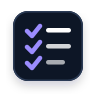

<Superhero slots="heading, text" variant="centered" textColor="white" background="rgb(64, 34, 138)"/>

# Guides

UXP is an extensibility platform that lets you build plugins for UXP-enabled Adobe apps like Photoshop, Premiere, and InDesign, with more hosts on the way, the same tools and workflow across every one.

## The development loop

Four pieces work together, whichever host application you're building for:

- **The host application** (Photoshop, Premiere, InDesign, and others) is where your plugin loads, its panel renders, and your code runs against the host's own APIs.
- **The UXP Developer Tool (UDT)** is the bridge. It scaffolds your plugin, then loads, reloads, and debugs it inside the host.
- **The UXP APIs** are the shared APIs available in every host, for the file system, network, storage, and UI. Together with each host's own APIs, they're what your plugin code calls.
- **Your code editor** is where you write the HTML, CSS, and JavaScript.

The loop is short: write code, reload in UDT, see the change in the host application.

## Find what you need

The sidebar follows the order you'll actually work in, not by product:

- **Start Here** - tech stack, terms, tools, and getting a first plugin running.
- **Build Plugins** - concepts, task-by-task how-to guides, recipes, and hybrid plugins.
- **Publish Plugins** - packaging and distribution.

The three starting points below get you into that path quickly:

<Cards slots="image, heading, text, links" repeat="3" width="100%" />

### Build Your First Plugin

New to UXP? Set up your tools and get a working plugin running, one step at a time.

[Start here](tutorials/build-your-first-plugin/index.md)

### How-to Guides

Already building? Find the guide for your task, from adding commands to packaging.

[Browse the how-to guides](how-to/index.md)

### Plugin Concepts

See how UXP plugins fit together: manifests, entrypoints, panels, and commands.

[Read the background](explanation/index.md)

Ready to ship? [Package & Distribute](how-to/distribution/overview/index.md) covers packaging, Adobe Marketplace, and enterprise or independent distribution.

Looking for class, method, and event documentation instead? That's under **API References** in the top navigation: [Premiere API](../premiere-api/index.md), [Media Encoder API](../media-encoder-api/index.md), and the [UXP API](../uxp-api/index.md).

## New to the terminology?

Plugins, panels, commands, manifests: see [Common Plugin Terms](explanation/fundamentals/nomenclature/index.md) for the full glossary and how it maps to CEP/ExtendScript.
