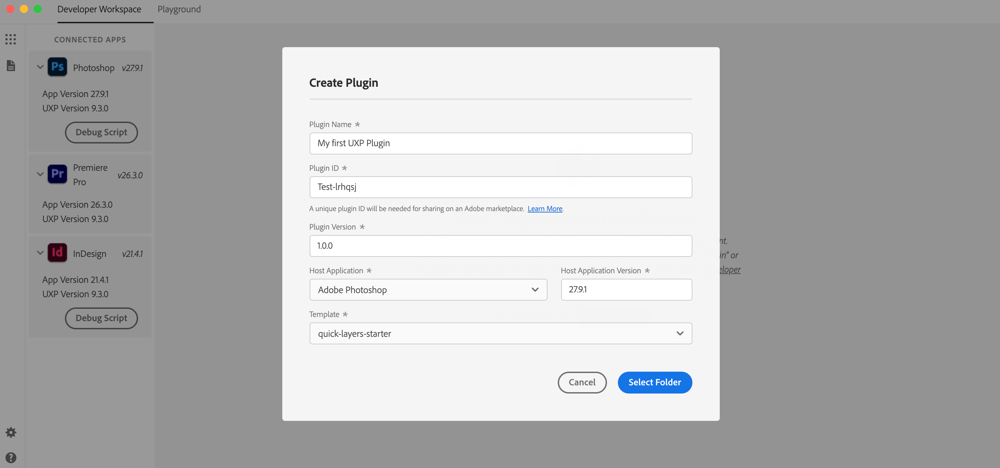
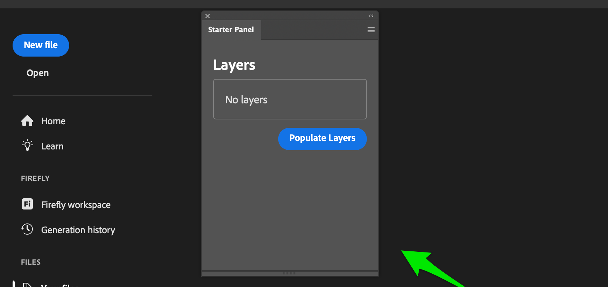
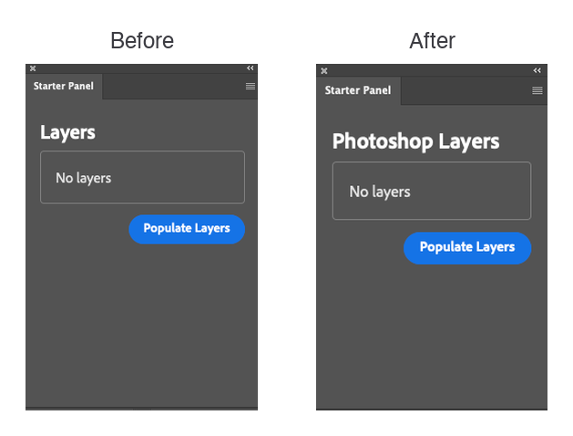

# Build Your First Plugin

Scaffold, load, and run a plugin inside your host application, reloading live as you edit: the same loop you'll use for every plugin after this. Examples use Photoshop, but the workflow is identical across every UXP-enabled host.

## Prerequisites

Before you start, make sure you have:

- Your host application installed: Photoshop, Premiere, InDesign, or Media Encoder.
- The [UXP Developer Tool](../../how-to/developer-tools/index.md#uxp-developer-tool-udt) (UDT), with [Developer Mode enabled](../../how-to/developer-tools/index.md#enable-developer-mode).
- A code editor of your choice, such as [Visual Studio Code](https://code.visualstudio.com/).

## 1. Scaffold your plugin

UDT can scaffold a ready-to-run plugin from a starter template instead of you starting from a blank folder. Open UDT and click **Create Plugin**.


A dialog opens where you set the plugin's details:

| Field | Premiere | Media Encoder | Photoshop | InDesign |
| --- | --- | --- | --- | --- |
| **Name** | My first UXP Plugin | My first UXP Plugin | My first UXP Plugin | My first UXP Plugin |
| **Plugin ID** | Leave it as is | Leave it as is | Leave it as is | Leave it as is |
| **Host Application** | Adobe Premiere Pro | Adobe Media Encoder | Adobe Photoshop | Adobe InDesign |
| **Host Application Version** | Leave as detected (keep the app open) | Leave as detected (keep the app open) | Leave as detected (keep the app open) | Leave as detected (keep the app open) |
| **Template** | `pr-quick-starter` | `ame-quick-starter` | `quick-layers-starter` | `quick-starter` |



Whichever host you select, the Template dropdown also offers general-purpose starters: `quick-starter` (plain HTML and JavaScript), `react-starter` (a React-based panel), and `webview-starter` (loads a web view). Pick the one that matches the kind of plugin you want to build.

Click **Select Folder** and choose a location for your plugin. UDT creates a new folder named after the Plugin ID, containing a `manifest.json` (plugin configuration), `index.html` (user interface), an `index.js` or `main.js` (logic), and a `README.md`.

## 2. Load it into your host application

Start your host application and confirm UDT can see it. It'll show up in the left pane.

In UDT, click **Load & Watch** in your plugin's row. This loads the plugin into the host and watches for source changes, reloading automatically. Keep the app open, and the panel appears in whichever host you loaded into.



The panel appears in the host after UDT loads it. The process is the same for Photoshop, Premiere, InDesign, and Media Encoder: keep the app open, click **Load & Watch**, and the panel shows up in that app.

<InlineAlert slots="text" />

If you've closed the panel, reopen it from your host application's **Plugins** or **Window** menu.

## 3. Edit the plugin's UI

With the panel running, open `index.html` in your code editor. The quick-layers starter renders a **Layers** heading; change its text:

```html
<sp-heading>Photoshop Layers</sp-heading>
```

Save the file. Load & Watch reloads the plugin automatically, and the panel heading changes from **Layers** to **Photoshop Layers**:



<InlineAlert slots="heading, text" variant="warning"/>

#### Manifest changes

Manifest changes don't hot-reload, so if you change `manifest.json`, you must manually unload and reload the plugin. In UDT, click **Unload**, then **Load & Watch** again.

## 4. Explore what your plugin can do

The starter is small but complete: a panel with a control that calls into the host. Click the button in its panel to see it run, then open `index.js` (or `main.js`) to see how the code reads from the host and updates the panel.

That same pattern covers real work, whichever host you target. Your plugin talks to two API surfaces: the shared [UXP APIs](../../../uxp-api/index.md) for the file system, network, storage, and more, and the host's own API for its documents, selections, and content. Check your host's reference under **Product API Refs** in the top navigation to see what it exposes.

## Next steps

You've got the loop: scaffold, load, edit, reload. Everything else you build follows the same pattern.

- Explore [Concepts](../../explanation/concepts/index.md) to understand manifests, entry points, panels, and commands in depth.
- Browse the [Premiere API](https://developer.adobe.com/premiere-pro/uxp/) or [Media Encoder API](https://developer-stage.adobe.com/media-encoder/uxp/) reference, or your host's own API reference if you're building for Photoshop or InDesign.
- Coming from CEP or ExtendScript? See [Migrate from CEP and ExtendScript](../../how-to/migration-guides/index.md) for what carries over.
