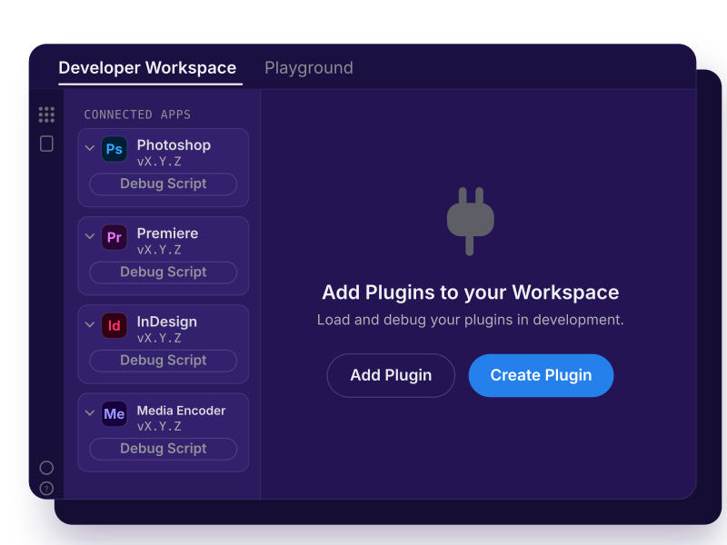

<Superhero variant="halfWidth" textColor="white" background="linear-gradient(135deg, #30186E 0%, #6432C8 100%)" slots="heading, text, image"/>

# Unified Extensibility Platform

Everything you need to build UXP plugins, in one place.

## What is UXP?

UXP (Unified Extensibility Platform) is Adobe's modern framework for building plugins and scripts in HTML, CSS, and JavaScript. It's built into Photoshop, Premiere, InDesign, and Media Encoder.

## What You Can Build

Every UXP plugin is built from one or both of two component types:

- **Commands** are actions: they run from a menu item, execute one task, and finish. There's no persistent UI beyond an optional dialog for input or confirmation.
- **Panels** are workspaces: they stay docked alongside the host's own panels, persistent and interactive throughout your session.

What you reach for depends on the host: layers and documents in Photoshop, pages and stories in InDesign, sequences and exports in Premiere, or render queues in Media Encoder. The plugin model is the same everywhere, and so is the panel/command choice. See Panels and Commands for the full picture, including modal dialogs and combining both in one plugin.

## Start Building

Every UXP plugin follows the same path, regardless of host application: scaffold a project, load it into your host app, build the UI, and ship it. [Guides](guides/index.md) walks through all of it: getting set up, core concepts, tutorials, and how to package and distribute what you build. Already have a CEP extension? Start at the [Migration Center](migration-center/index.md) instead.

## Choose a Host

Pick the application you already spend your time in for its API reference and product-specific docs. UXP itself works the same way underneath each of them.

<Cards slots="image, heading, text, links" repeat="4" width="100%" />

### Photoshop

Automate imaging work: documents, layers, selections, and actions.

[Explore Photoshop](https://developer.adobe.com/photoshop/uxp/)

### InDesign

Build tools for layout and publishing: pages, stories, styles, and frames.

[Explore InDesign](https://developer.adobe.com/indesign/uxp/)

### Premiere

Build tools for editorial work: projects, sequences, tracks, markers, and exports.

[Explore Premiere](https://developer.adobe.com/premiere-pro/uxp/)

### Media Encoder

Automate delivery work: presets, codecs, render queues, and batch exports.

[Explore Media Encoder](https://developer-stage.adobe.com/media-encoder/uxp/)

## How UXP Works

A UXP plugin runs inside the host application on a single JavaScript engine. That engine exposes both the shared [UXP APIs](uxp-api/index.md) and the host's own DOM API directly, with none of the ExtendScript bridging or per-plugin browser instances that CEP relied on. Your calls are async, so they don't freeze the host while they run.

Your interface is still HTML and CSS, but UXP isn't a browser. Its layout engine maps what you write to the host's native controls, so panels match the app and render without a heavy embedded browser. Support is deliberate: an element, CSS property, or web API works only when UXP implements it. Check the [shared UXP API](uxp-api/index.md) for what's available, then use your host's API reference to work with documents, projects, and timelines.

## More Resources

Once your plugin runs, the next questions are usually about testing, packaging, and getting it in front of people. Start here:

- **Developer journey:** the full build-and-ship path, from setup to shipping, is covered in [Guides](guides/index.md).
- **UXP API reference:** check the [UXP APIs](uxp-api/index.md) section for what's available on the shared platform.
- **Share and distribute your plugin:** package it, publish through Adobe Marketplace, or distribute independently and within an enterprise.
- **[FAQ](faq/index.md):** quick answers to common setup, packaging, and compliance questions.

## Join the Community

Connect with other UXP developers, ask questions, and share what you've built.

- Ask questions and share knowledge in the [Creative Cloud Developer Forums](https://forums.creativeclouddeveloper.com/).
- Subscribe to the [Creative Cloud Developer Newsletter](https://www.adobe.com/subscription/ccdevnewsletter.html).
