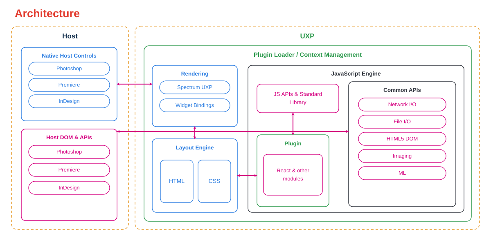

<Superhero variant="halfWidth" textColor="white" slots="heading, text, image" background="url(images/hero-bg.svg) center/cover no-repeat, linear-gradient(100deg, #2A5BFF 0%, #5A6BFF 33%, #8B5CFF 66%, #D26BFF 100%)"/>

# Unified Extensibility Platform

Everything you need to build UXP plugins — in one place.

## What is UXP?

UXP (Unified Extensibility Platform) is Adobe's modern framework for building plugins and scripts in HTML, CSS, and JavaScript. It's built into Photoshop, Premiere Pro and InDesign.

## What You Can Build

UXP plugins usually take one of two shapes:

- **Panels** stay open next to your project with focused, persistent controls.
- **Commands** run from a menu item and complete one task from start to finish.

What you reach for depends on the workflow: layers and documents in Photoshop, pages and stories in InDesign, or sequences and exports in Premiere Pro. The plugin model is the same everywhere.

## Start Building

Every UXP plugin follows the same path, regardless of host application: scaffold a project, load it into your host app, build the UI, and ship it. [Guides](introduction/index.md) walks through all of it — getting set up, core concepts, tutorials, and how to package and distribute what you build.

## Choose a Host

Pick the application you already spend your time in for its API reference and product-specific docs. UXP itself works the same way underneath each of them.

<Cards slots="image, heading, text, links" repeat="4" width="100%" />

### Photoshop

Automate imaging work: documents, layers, selections, and actions.

[Explore Photoshop](https://developer.adobe.com/photoshop/uxp/)

### InDesign

Build tools for layout and publishing: pages, stories, styles, and frames.

[Explore InDesign](https://developer.adobe.com/indesign/uxp/)

### Premiere

Build tools for editorial work: projects, sequences, tracks, markers, and exports.

[Explore Premiere](https://developer.adobe.com/premiere-pro/uxp/)

### Media Encoder

Automate delivery work: presets, codecs, render queues, and batch exports.

[Explore Media Encoder](https://developer-stage.adobe.com/media-encoder/uxp/)

## How UXP Works

A UXP plugin runs inside the host application on a single JavaScript engine. That engine exposes both the shared [UXP APIs](uxp-api/index.md) and the host's own DOM API directly, with none of the ExtendScript bridging or per-plugin browser instances that CEP relied on.

Your interface is built with HTML and CSS, but UXP isn't a full browser: only the elements, styles, and APIs UXP implements are supported. Check the [UXP APIs](uxp-api/index.md) for what's available at the platform level, then use your host's own API reference to work with documents, projects, and timelines.

## Join the Community

Connect with other UXP developers, ask questions, and share what you've built.

- [Adobe Creative Cloud Developer Forums](https://forums.creativeclouddeveloper.com/)
- [Adobe Community](https://community.adobe.com/community)
