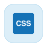

<Superhero slots="heading, text" variant="centered" textColor="white" background="linear-gradient(135deg, #30186E 0%, #6432C8 100%)"/>

# UXP API Reference

The UXP API is the platform layer shared across UXP-enabled host applications: JavaScript, CSS, HTML, and Spectrum UI, plus modules for file system access, networking, storage, and entry points.

Learn the platform layer once, and it carries over everywhere. Each host application then adds its own DOM API on top — for documents, layers, sequences, and other host-specific objects — which is what you'll reach for once you're past the platform basics covered here.

<Cards slots="image, heading, text, links" repeat="4" width="100%" />

### JavaScript Reference

Global members and modules available in every UXP plugin: crypto, storage, networking, and the file system.

[Browse the JavaScript reference](reference-js/index.md)

### CSS Reference

Supported selectors, pseudo-classes, pseudo-elements, media queries, and style properties.

[Browse the CSS reference](reference-css/index.md)

### HTML Reference

Supported HTML elements, attributes, and document hierarchy.

[Browse the HTML reference](reference-html/index.md)

### Spectrum UXP Reference

Spectrum UXP Widgets and Spectrum Web Components for building UI that matches the host application.

[Browse the Spectrum reference](reference-spectrum/index.md)

## Host Application DOM APIs

Each host application layers its own DOM API for documents, layers, sequences, and other host-specific objects on top of the platform layer above.

<Cards slots="image, heading, text, links" repeat="4" width="100%" />

### Photoshop API

DOM API for images, layers, documents, and Camera Raw workflows in Photoshop.

[Explore the Photoshop API](https://developer.adobe.com/photoshop/uxp/2022/ps-reference/?aio_external=true)

### Premiere API

DOM API for projects, sequences, tracks, and media in Premiere.

[Explore the Premiere API](https://developer.adobe.com/premiere-pro/uxp/ppro-reference/?aio_external=true)

### InDesign API

DOM API for documents, pages, and layout objects in InDesign.

[Explore the InDesign API](https://developer.adobe.com/indesign/uxp/dom/api/?aio_external=true)

### Media Encoder API

DOM API for presets, codecs, and render queues in Media Encoder.

[Explore the Media Encoder API](https://developer-stage.adobe.com/media-encoder/uxp/media-encoder-api/?aio_external=true)

## Known Issues

Exact support can vary by host application and UXP version. See [Known Issues](known-issues.md) for documented platform-level limitations and workarounds.

## Version Details and Change Log

Track which UXP version ships in each host application, and what's new, changed, or fixed in each release.

<Cards slots="image, heading, text, links" repeat="2" width="100%" />

### Version Details

Which UXP version ships in which host application, and the ECMAScript and React versions UXP currently supports.

[View version details](versions.md)

### Change Log

What's new, changed, deprecated, and fixed in each UXP release.

[View the change log](changelog.md)
